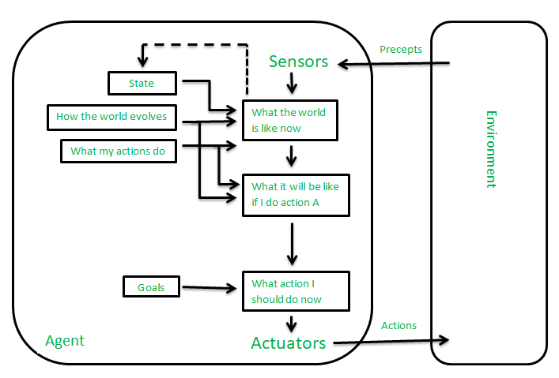
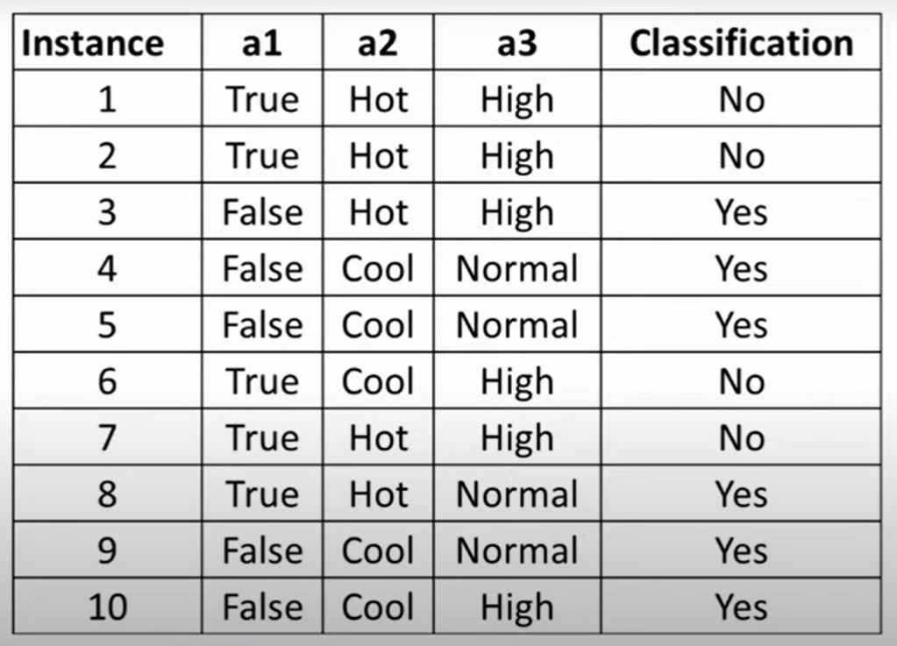

# BAI ESE
## TENTATIVE
###  THIS IS NOT PROVIDED BY JAGRUTI MAM IISE KAAM CHALA LO


1

Introduction to AI 

Introduction and History of Artificial Intelligence, AI Categorization, 
Components of AI, Foundations of AI, Applications and Cu rrent trends in AI


2

Intelligent Agents and Problem solving
Agents and Environments, The concept of rationality, The nature of 
environment, The structure of Agents, Types of Agents, Learning Agent, AI 
applications for various types of agents, Problem Solving Agent, Formulating 
Problems and Example Problems


3

Searching Techniques

Uninformed Search Methods, Informed Search Methods, Local Search 
Methods,Genetic Algorithm, Adversarial Search, Constraint Satisfaction 
Problems, (Tabu Search), Real time applications of all search methods


4

Knowledge and Reasoning

Knowledge based Agents, The Wumpus World Problem, The Propositional 
logic, First Order Logic: Syntax and Semantic, Inference in FOL, Forward 
chaining and backward Chaining,Unification and Resolution, Uncertain 
knowledge and reasoning( Handling Uncertain Knowledge, Prior and Posterior 
Probability ), Real time application of certain & uncertain knowledge and 
reasoning 


5

Planning and Learning

The planning problem, Planning with state space search, Partial order planning 
, Hierarchical planning, Conditional Planning , Learning: Forms of Learning, 
Inductive Learning, Learning Decision Tree, ID3 Algorithm 


6

Expert Systems and Sub Areas of AI

Expert System, Machine Learning , Deep Learning ,Natural Language 
Processing with tool TextRazor,(Speech Recognition),Prompt 
Engineering,OpenAI Integration


Module 1:- Introduction To AI
2 Mark Topics:-
1.	List the Goals of Artificial Intelligence.


Here are concise and structured answers for each of the provided 2-mark questions:

### 1. List the Goals of Artificial Intelligence.
- **Automation**: Create systems that can perform tasks without human intervention.
- **Problem-Solving**: Develop algorithms to solve complex problems.
- **Learning and Adaptation**: Enable machines to learn from data and experiences.
- **Human Interaction**: Improve human-computer interaction through natural language processing and understanding.


----
----
----
2.	Give the Task Classification of Artificial Intelligence.

----
----
----


### 2. Give the Task Classification of Artificial Intelligence.
- **Reasoning**: Deductive and inductive reasoning.
- **Knowledge Representation**: Storing information about the world.
- **Planning and Scheduling**: Organizing actions to achieve goals.
- **Learning**: Machine learning and data mining.
- **Natural Language Processing**: Understanding and generating human language.
- **Perception**: Processing sensory inputs like vision and sound.
- **Motion and Manipulation**: Robotics and controlling physical actions.


----
----
----
3.	Give Any two real-time Applications of Artificial Intelligence.

----
----
----


### 3. Give Any Two Real-Time Applications of Artificial Intelligence.
- **Healthcare**: AI-powered diagnostic tools (e.g., IBM Watson for Oncology).
- **Finance**: Fraud detection systems (e.g., credit card fraud detection by banks).


----
----
----
4.	Give the Categorization of AI based on Capabilities with one real time example of each.

----
----
----


### 4. Give the Categorization of AI based on Capabilities with One Real-Time Example of Each.
- **Narrow AI (Weak AI)**: Performs a specific task.
  - *Example*: Siri, virtual personal assistant.
- **General AI (Strong AI)**: Human-level intelligence across various tasks.
  - *Example*: Hypothetical, not yet achieved.
- **Superintelligent AI**: Surpasses human intelligence.
  - *Example*: Theoretical, not yet achieved.


----
----
----

5.	Identify & Describe the Main Components of an AI system.
•	Advantages & Disadvantages of AI
•	Strong AI vs Weak AI
•	Define Intelligence & its Categories. – Natural & Artificial

----
----
----
### 5. Identify & Describe the Main Components of an AI System.
- **Data**: The raw information AI systems learn from.
- **Algorithms**: The logic and rules AI uses to process data.
- **Model**: The trained representation of the data used to make predictions or decisions.
- **Hardware**: The physical devices running AI algorithms, such as GPUs.

#### Advantages & Disadvantages of AI
- **Advantages**:
  - Automation of repetitive tasks.
  - Enhanced decision-making capabilities.
  - Ability to process large volumes of data quickly.
- **Disadvantages**:
  - Potential job displacement.
  - Ethical concerns and biases in decision-making.
  - High cost of development and implementation.

#### Strong AI vs Weak AI
- **Strong AI**:
  - Can perform any intellectual task that a human can.
  - Possesses consciousness, self-awareness.
  - Not yet realized.
- **Weak AI**:
  - Specialized in one task.
  - No consciousness or genuine understanding.
  - Examples: Chatbots, image recognition systems.

#### Define Intelligence & Its Categories – Natural & Artificial
- **Intelligence**: The ability to learn, understand, and apply knowledge.
  - **Natural Intelligence**: Exhibited by humans and animals.
    - *Example*: Human problem-solving, animal navigation.
  - **Artificial Intelligence**: Exhibited by machines and systems.
    - *Example*: Chess-playing computer, autonomous driving systems.


----
----
----

## 5 Markers M1
1.	Discuss Various Foundation Areas with AI in detail.

----
----
----


### 1. Discuss Various Foundation Areas with AI in Detail

#### Background Theory:
Artificial Intelligence (AI) encompasses a wide range of techniques and methodologies aimed at creating systems that can perform tasks requiring human-like intelligence. These systems are built upon several foundational areas that contribute to their development and functionality.

#### Detailed Explanation:
1. **Machine Learning (ML)**:
   - ML algorithms enable AI systems to learn from data and improve performance over time without explicit programming.
   - Techniques include supervised learning, unsupervised learning, and reinforcement learning.
   - Applications: Predictive analytics, recommendation systems, image recognition.

2. **Natural Language Processing (NLP)**:
   - NLP focuses on enabling computers to understand, interpret, and generate human language.
   - Techniques include sentiment analysis, text summarization, and language translation.
   - Applications: Chatbots, virtual assistants, language translation services.

3. **Computer Vision**:
   - Computer vision involves enabling machines to interpret and analyze visual information from the real world.
   - Techniques include image classification, object detection, and image segmentation.
   - Applications: Autonomous vehicles, facial recognition, medical image analysis.

4. **Robotics**:
   - Robotics integrates AI, sensors, and mechanical systems to create machines capable of performing physical tasks autonomously.
   - Techniques include motion planning, manipulation, and sensor fusion.
   - Applications: Industrial automation, surgical robotics, service robots.

5. **Knowledge Representation and Reasoning**:
   - Knowledge representation involves encoding knowledge in a format that computers can understand and reason with.
   - Techniques include logic-based reasoning, ontologies, and semantic networks.
   - Applications: Expert systems, semantic web, decision support systems.


----
----
----
2.	List & Explain in detail The Types of Artificial Intelligence with Example of each.
•	History of AI.
•	Intelligence & Types of Intelligence. – Linguistic, Musical.. etc
•	Explain Components of AI – Reasoning, Learning, Perception, Problem Solving, Linguistic Intelligence.

----
----
----


### 2. List & Explain in Detail The Types of Artificial Intelligence with Example of Each

#### Background Theory:
Artificial Intelligence (AI) can be categorized into different types based on its capabilities and functionalities. Each type represents a distinct approach to building intelligent systems.

#### Detailed Explanation:
1. **History of AI**:
   - AI has evolved over decades, starting with symbolic AI in the 1950s, followed by the emergence of neural networks and machine learning in the 1980s.
   - Recent advancements in deep learning and reinforcement learning have led to significant breakthroughs in AI applications.

2. **Intelligence & Types of Intelligence**:
   - Intelligence refers to the ability to learn, understand, and apply knowledge to solve problems.
   - Types of intelligence include:
     - **Linguistic Intelligence**: Ability to understand and manipulate language. Example: Chatbots like Siri or Alexa.
     - **Musical Intelligence**: Ability to understand and create music. Example: Music recommendation systems like Spotify.

3. **Components of AI**:
   - AI systems consist of several components that enable them to exhibit intelligent behavior:
     - **Reasoning**: The ability to draw conclusions and make decisions based on available information.
     - **Learning**: The capability to acquire knowledge and improve performance over time.
     - **Perception**: The process of interpreting and understanding sensory inputs from the environment.
     - **Problem Solving**: The ability to formulate and solve problems using algorithms or heuristics.
     - **Linguistic Intelligence**: Understanding and generating human language, enabling communication with users in natural language.

These foundational areas and types of AI provide the building blocks for creating intelligent systems capable of performing a wide range of tasks across various domains.


----
----
----


Module 2:- Intelligent Agents & Problem Solving
2 Mark Topics:-


----
----
----
1.	List and Define the Terms to Define a Problem.

----
----
----
#### 1. List and Define the Terms to Define a Problem.
- **Initial State**: The starting condition from which the problem-solving process begins.
- **Goal State**: The desired condition or outcome that the problem-solving process aims to achieve.
- **Operators**: The actions or steps that can be taken to move from one state to another.
- **State Space**: The entire set of possible states that can be reached from the initial state using the operators.
- **Path Cost**: The cumulative cost associated with reaching a particular state from the initial state, typically used to evaluate the efficiency of different paths.


----
----
----

2.	List all the Environment Characteristics.

----
----
----


#### 2. List all the Environment Characteristics.
- **Fully Observable vs. Partially Observable**: Whether the agent has access to the complete state of the environment at all times.
- **Deterministic vs. Stochastic**: Whether the next state of the environment is completely determined by the current state and the agent's action.
- **Episodic vs. Sequential**: Whether the agent’s experience is divided into atomic episodes with no dependence on previous actions, or if current decisions affect future states.
- **Static vs. Dynamic**: Whether the environment changes while the agent is deliberating.
- **Discrete vs. Continuous**: Whether the environment has a finite number of distinct states and actions, or a range of possible states and actions.
- **Single-Agent vs. Multi-Agent**: Whether there is only one agent operating in the environment or multiple agents interacting with each other.


----
----
----
3.	Formulate Problem for N-Queens.

----
----
----

#### 3. Formulate Problem for N-Queens.
- **Initial State**: An empty \( N \times N \) chessboard with no queens placed.
- **Goal State**: A configuration where \( N \) queens are placed on the board such that no two queens threaten each other.
- **Operators**: Placing a queen in an empty square of the current configuration.
- **State Space**: All possible ways of placing 0 to \( N \) queens on the board, one per column, ensuring no two queens attack each other.
- **Path Cost**: Typically not applicable as the problem is about finding any valid solution rather than optimizing a cost.

----
----
----
4.	Interpret PEAS representation for Interactive English Tutor.

----
----
----

### 4. Interpret PEAS Representation for Interactive English Tutor

- **P (Performance Measure)**:
  - Improvement in student's language skills.
  - Student engagement and satisfaction.
  - Accuracy of responses.
  - Completion of exercises.

- **E (Environment)**:
  - Virtual classroom or learning platform.
  - Student interactions (questions, responses).
  - Texts and exercises for practice.
  - Real-time feedback system.

- **A (Actuators)**:
  - Displaying text and multimedia content.
  - Providing prompts and hints.
  - Offering feedback and corrections.
  - Recording student responses and progress.

- **S (Sensors)**:
  - Keyboard/mouse input from the student.
  - Voice recognition (if applicable).
  - Response times and patterns.
  - Progress tracking data.


----
----
----
5.	Examine Environment Characteristics for a Crossword Puzzle.

----
----
----

### 5. Examine Environment Characteristics for a Crossword Puzzle

- **Fully Observable vs. Partially Observable**: Fully observable - the entire crossword grid and clues are visible to the player.
- **Deterministic vs. Stochastic**: Deterministic - each clue has a specific correct answer, and actions (filling in letters) have predictable outcomes.
- **Episodic vs. Sequential**: Sequential - current actions (filling in words) depend on previous actions and influence future moves.
- **Static vs. Dynamic**: Static - the crossword grid and clues do not change while solving.
- **Discrete vs. Continuous**: Discrete - finite set of letters and positions on the grid.
- **Single-Agent vs. Multi-Agent**: Typically single-agent - one player solves the puzzle, though collaborative solving can involve multiple agents.


----
----
----

6.	Define Rational Agent with Example.

----
----
----

### 6. Define Rational Agent with Example

- **Definition**: A rational agent is one that acts to achieve the best possible outcome or, when there is uncertainty, the best expected outcome based on its knowledge and available information.

- **Example**: 
  - **Autonomous Vacuum Cleaner**:
    - **Performance Measure**: Cleanliness of the floor, coverage of the area, time taken.
    - **Environment**: House layout, presence of furniture and obstacles, dirt locations.
    - **Actuators**: Wheels for movement, vacuum motor for cleaning, brushes for sweeping.
    - **Sensors**: Cameras or infrared sensors for navigation, dirt sensors for detecting dirty spots.
    - **Rationality**: The vacuum cleaner uses its sensors to detect dirt and obstacles, plans a cleaning path to maximize coverage and cleanliness while avoiding obstacles, and returns to the charging station when needed.


----
----
----
7.	Differentiate between Simple-Reflex Agent & a Goal-Based Agent.

•	Define Agent & Environment
•	Structure of Agents
•	Define Problem Solving & Problem Solving Agent
----
----
----

### 7. Differentiate between Simple-Reflex Agent & Goal-Based Agent

- **Simple-Reflex Agent**:
  - **Definition**: Acts only based on the current percept, ignoring the rest of the percept history.
  - **Characteristics**:
    - Uses condition-action rules.
    - Limited to predefined responses.
    - Does not consider the future consequences of its actions.
  - **Example**: A thermostat that turns the heater on if the temperature is below a certain threshold.

- **Goal-Based Agent**:
  - **Definition**: Acts to achieve specific goals, taking into account the future consequences of actions.
  - **Characteristics**:
    - Considers the desired outcome (goal) and plans actions accordingly.
    - More flexible and adaptable to changes in the environment.
    - Utilizes search and planning algorithms.
  - **Example**: A navigation system that plans a route to a destination.

### Define Agent & Environment

- **Agent**:
  - **Definition**: An entity that perceives its environment through sensors and acts upon it through actuators to achieve specific goals.
  - **Example**: A robot vacuum cleaner, an autonomous car, or a virtual personal assistant.

- **Environment**:
  - **Definition**: The external context or surroundings in which an agent operates and with which it interacts.
  - **Example**: For a robot vacuum cleaner, the environment includes the layout of the home, furniture, and obstacles.

### Structure of Agents

- **Simple-Reflex Agents**:
  - **Components**: Condition-action rules.
  - **Operation**: Reacts directly to percepts.
  - **Example**: Light switch that turns on when it detects darkness.

- **Model-Based Reflex Agents**:
  - **Components**: Internal state to keep track of unobserved aspects of the environment.
  - **Operation**: Uses a model of the world to handle partially observable environments.
  - **Example**: A more advanced thermostat that learns patterns and adjusts settings accordingly.

- **Goal-Based Agents**:
  - **Components**: Goals, planning capabilities.
  - **Operation**: Takes actions to achieve specific goals, uses search and planning algorithms.
  - **Example**: Autonomous car planning a route to a destination.

- **Utility-Based Agents**:
  - **Components**: Utility function to evaluate the desirability of different states.
  - **Operation**: Chooses actions to maximize its utility, balancing multiple goals.
  - **Example**: Investment software that balances risk and return to maximize portfolio value.

- **Learning Agents**:
  - **Components**: Learning element, performance element, critic, problem generator.
  - **Operation**: Improves its performance based on past experiences.
  - **Example**: Spam filter that improves accuracy over time.

### Define Problem Solving & Problem Solving Agent

- **Problem Solving**:
  - **Definition**: The process of finding a sequence of actions that leads from the initial state to the goal state.
  - **Components**: Problem formulation, search for solutions, execution of the chosen solution.

- **Problem Solving Agent**:
  - **Definition**: An agent that uses a search algorithm to find a sequence of actions that leads to a goal state.
  - **Characteristics**:
    - Clearly defines the problem in terms of initial state, goal state, and possible actions.
    - Utilizes search strategies to explore the state space and find solutions.
  - **Example**: Chess-playing AI that plans moves ahead to checkmate the opponent.


----
----
----
## 5 Markers M2
1.	Explain Model Based Agents with the help of Architecture Diagram.

----
----
----


## Model-Based Agents: Architecture and Explanation (Basic AI Exam Prep)

**Model-Based Agents:**

These agents maintain an internal representation (model) of the environment they operate in. This model helps them reason about the potential consequences of their actions before taking them. Unlike simple reflex agents, model-based agents are not solely reliant on immediate sensor data.

**Architecture Diagram:**

```
       Percepts (Sensors)
          |
       Model
          |
       Action Selection
          |
       Actions (Actuators)
```

**Components:**

1. **Percepts (Sensors):** Gather information about the world (e.g., robot explorer's camera capturing images).
2. **Model:** An internal representation of the environment, including:
    - **State:** The current state of the world (e.g., robot's location, objects present).
    - **Dynamics:** How the world changes due to actions (e.g., robot movement, object interactions).
3. **Action Selection:** Chooses actions based on the model and the desired goal. It considers:
    - Predicted outcomes of actions.
    - Goal achievement in the simulated environment.
4. **Actions (Actuators):** Physical actions the agent takes (e.g., robot moves based on the chosen action).

**Working:**

1. **Perceive:** The agent senses the environment to update its internal model (e.g., robot explorer sees a wall on its left).
2. **Model Update:** The model is updated with the new information from the percepts (e.g., "wall" added to the robot's map).
3. **Action Selection:** Considering the goal (e.g., reach a specific location) and the updated model, the agent chooses an action with the highest chance of success (e.g., turn right to avoid the wall).
4. **Action Execution:** The chosen action is carried out in the real world (e.g., robot turns right).

**Benefits:**

- **Planning:** Can plan actions based on predicted outcomes in the model.
- **Adaptability:** Can handle partially observable environments and unexpected changes by updating the model.

**Remember:** This is a simplified explanation. Building and maintaining accurate models can be challenging, especially in complex environments. Focus on understanding the core concept of using an internal model to guide action selection for your exam. 


----
----
----
2.	Explain Goal Based Agents with the help of Architecture Diagram.

----
----
----

## Goal-Based Agents: Architecture and Explanation (Basic AI Exam Prep)

**Goal-Based Agents:**

These agents are designed to achieve specific objectives or goals in their environment. Unlike simpler reflex agents that react directly to stimuli, goal-based agents consider future consequences and plan their actions accordingly.

**Architecture Diagram:**

```
       Percepts (Sensors)
          |
       Goal Module
          |
       Plan Generator
          |
       Action Module
          |
       Actions (Actuators)
```

**Components:**

1. **Percepts (Sensors):** Gather information from the environment (e.g., robot arm sensors detecting object location).
2. **Goal Module:** Stores the desired goal state (e.g., pick up a cup).
3. **Plan Generator:** Develops a sequence of actions to achieve the goal (e.g., move arm, grasp cup, lift cup).
4. **Action Module:** Executes the planned actions (e.g., sends commands to robot arm).
5. **Actions (Actuators):** Physical actions the agent takes in the environment (e.g., robot arm movements).

**Working:**

1. **Perceive:** The agent senses the environment to understand its current state.
2. **Set Goal:** The goal module receives the desired goal (e.g., pick up a cup).
3. **Plan Generation:** The plan generator uses the current state, goal state, and knowledge about the environment to create a sequence of actions (e.g., move arm closer, grasp cup, lift cup).
4. **Action Execution:** The action module sends commands to execute the planned actions (e.g., robot arm extends, closes gripper, lifts cup).
5. **Monitoring:** The agent may continuously monitor its progress and replan if necessary due to unexpected changes or obstacles.

**Benefits:**

- **Flexibility:** Can handle complex goals and adapt plans based on changing situations.
- **Reasoning:** Can consider future consequences before taking actions.

**Remember:** This is a basic overview. Goal-based agents may involve more sophisticated planning algorithms and knowledge representation techniques. Focus on understanding the key concept of using a goal to guide a sequence of actions for your exam.


----
----
----
3.	Sketch & Discuss the Working and Real-Time Application of Utility-Based Agents.

----
----
----


## Utility-Based Agents: Sketch, Working, and Applications (Basic AI Exam Prep)

**Sketch:**

Imagine an agent with sensors (eyes, ears) perceiving the environment and actuators (arms, legs) to take actions. Inside, there's a decision-making process based on:

- **Sensors:** Provide raw information about the world.
- **Utility Function:** Assigns a score (utility) to different situations (states) the agent might encounter. Higher scores represent more desirable situations.
- **Action Selection:** The agent chooses the action that leads to the state with the highest expected utility.

**Working:**

1. **Perceive:** The agent gathers information from its environment (e.g., a robot vacuum cleaner senses dust on the floor).
2. **Evaluate:** The agent uses its utility function to determine the "happiness" (utility) associated with different actions it can take (e.g., cleaning the dust vs. going to recharge). Factors like dirt level, battery life, and cleaning priority would influence the utility values.
3. **Act:** The agent chooses the action with the highest expected utility (e.g., if cleaning the dust has a higher utility than recharging at that moment, the agent cleans).

**Real-Time Applications:**

- **Robot Vacuum Cleaners:** Utility functions consider dirt level, battery life, and cleaning schedule to decide when and where to clean.
- **Personal Assistants:** Utility functions might prioritize urgent tasks, user preferences, and time constraints to suggest actions like booking appointments or reminding about deadlines.
- **Self-Driving Cars:** Utility functions consider traffic conditions, safety, and destination to choose the best route and driving behavior.

**Benefits:**

- **Flexibility:** Can handle complex situations by considering multiple factors.
- **Adaptability:** Can adjust behavior based on changing goals or environments by updating the utility function.

**Remember:** This is a simplified explanation. Utility functions can be complex, and real-world applications involve additional considerations. Focus on understanding the core concept of maximizing "happiness" through actions for your exam.


----
----
----
4.	Formulate the 8-Puzzle problem Stepwise. Solve the problem given below.. Intial State -> Goal State.
•	Explain Learning Agent/Simple Reflex Agent with the help of Architecture Diagram.
•	Explain Water Jug Problem with Example.
•	Explain Intelligent Agent-Characteristics, Rules & Architecture.


----
----
----


## 8-Puzzle Problem Formulation and Solution (Basic AI Exam Prep)

**Formalization:**

1. **State:** A configuration of the 8 tiles on the 3x3 board, with one empty space. Represented as a matrix or a string.
2. **Initial State:** The starting configuration of the tiles.
3. **Goal State:** The desired configuration where tiles are arranged in a specific order, with the empty space in a particular position.
4. **Actions:** Moving the empty space to an adjacent tile (up, down, left, right), creating a new configuration.
5. **Cost Function:** Typically, moving a tile costs 1 unit.

**Example:**

```
Initial State:   Goal State:
[1, 2, 3]       [1, 2, 3]
[4, 5, 6]  ->   [4, 8, 5]
[7, 8,  ]       [7, 6,  ]
```

**Solving with an uninformed search algorithm (e.g., BFS) is possible but can be inefficient.**

**Learning Agent/Simple Reflex Agent:**

**Architecture:**

```
       Percepts (Sensors)
          |
       Agent Program
          |
       Actions (Actuators)
```

- **Percepts:** Information the agent receives from the environment (e.g., tile positions in 8-puzzle).
- **Agent Program:** Maps the percepts to actions based on a set of pre-defined rules (e.g., move the empty space towards a specific tile).
- **Actions:** The agent's actions in the environment (e.g., moving the tile in 8-puzzle).

**Simple reflex agents react directly to percepts without considering the history or future consequences.**

**Water Jug Problem:**

**Example:**

You have two jugs (capacity 5 liters and 3 liters) and need to fill a 4-liter jug. Actions include filling, emptying, and pouring water between jugs. The goal is to reach a state where the 4-liter jug is full.

**Intelligent Agent Characteristics:**

- **Perceptibility:** Ability to sense the environment.
- **Reactivity:** Ability to respond to changes in the environment.
- **Learning:** Ability to improve performance over time.
- **Reasoning:** Ability to draw conclusions based on knowledge.
- **Adaptation:** Ability to change behavior based on new information.

**Intelligent Agent Architecture:**

Similar to the simple reflex agent, but with additional capabilities:

- **Learning Module:** Learns from experience and updates its knowledge base.
- **Reasoning Module:** Uses knowledge and reasoning to make decisions.

**Remember:** This is a basic overview. Focus on understanding the key concepts and formulating answers concisely for your exam. 


----
----
----


## Module 3:- Searching Techniques
## 2 Markers M2

1.	Compare Depth limited Search Vs. Iterative Deepening Search.

----
----
----

### Module 3: Searching Techniques

#### 1. Compare Depth-Limited Search vs. Iterative Deepening Search

- **Depth-Limited Search (DLS)**:
  - **Definition**: A variant of Depth-First Search (DFS) that limits the depth of exploration to a predetermined level \( l \).
  - **Characteristics**:
    - Avoids infinite loops in cyclic graphs.
    - May fail to find a solution if the limit \( l \) is too low.
  - **Space Complexity**: \( O(l) \) (linear in the depth limit).
  - **Time Complexity**: \( O(b^l) \) (where \( b \) is the branching factor and \( l \) is the depth limit).
  - **Example Use Case**: Searching for a path within a bounded depth in large graphs.

- **Iterative Deepening Search (IDS)**:
  - **Definition**: A combination of Depth-First Search and Breadth-First Search that repeatedly applies Depth-Limited Search with increasing limits until a solution is found.
  - **Characteristics**:
    - Finds the shortest path to the goal (optimal for uniform cost).
    - Combines the space efficiency of DFS with the optimality of BFS.
  - **Space Complexity**: \( O(d) \) (linear in the depth of the shallowest goal).
  - **Time Complexity**: \( O(b^d) \) (where \( d \) is the depth of the shallowest goal).
  - **Example Use Case**: Solving puzzles like the 8-puzzle or 15-puzzle.


----
----
----

2.	Outline Steps included in Genetic Algorithm.

----
----
----

#### 2. Outline Steps Included in Genetic Algorithm

1. **Initialization**: Generate an initial population of potential solutions randomly.
2. **Selection**: Evaluate the fitness of each individual and select the fittest individuals for reproduction.
3. **Crossover (Recombination)**: Combine pairs of selected individuals to create offspring by exchanging portions of their structure.
4. **Mutation**: Introduce random changes to individual offspring to maintain genetic diversity.
5. **Replacement**: Replace some or all of the population with the new generation.
6. **Termination**: Repeat the process until a stopping criterion is met (e.g., a solution is found, a maximum number of generations is reached, or the fitness level is satisfactory).


----
----
----

3.	Give Algorithmic Steps for Genetic Algorithm.

----
----
----

#### 3. Give Algorithmic Steps for Genetic Algorithm

1. **Start**: Generate an initial population of \( P \) individuals.
2. **Evaluate**: Compute the fitness of each individual in the population.
3. **Repeat**:
   - **Selection**: Select \( P \) parents from the current population based on fitness.
   - **Crossover**: Perform crossover on pairs of parents to produce offspring.
   - **Mutation**: Apply mutation to some offspring.
   - **Evaluation**: Evaluate the fitness of the new individuals.
   - **Replacement**: Form a new population by replacing some or all of the old population with the new individuals.
4. **Until**: A stopping criterion is met (e.g., a solution is found, a maximum number of generations is reached, or the fitness level is satisfactory).
5. **End**: Output the best solution found.


----
----
----


4.	Discuss Drawbacks of Min-Max Algorithm.

----
----
----


#### 4. Discuss Drawbacks of Min-Max Algorithm
- **Computationally Expensive**: 
  - Time complexity is \( O(b^d) \) where \( b \) is the branching factor and \( d \) is the depth of the tree. This makes it impractical for large game trees.
- **Limited to Perfect Information**:
  - Requires complete information about the game, which is not feasible for games with hidden elements or uncertainty.
- **Memory Intensive**:
  - High space complexity due to storing all nodes in the game tree.
- **Difficulty Handling Deep Trees**:
  - Struggles with deep game trees due to exponential growth, necessitating the use of heuristics or pruning methods like alpha-beta pruning.

----
----
----
5.	Differentiate A* & Best-First Search(Greedy).

----
----
----


#### 5. Differentiate A* & Best-First Search (Greedy)
- **A\***:
  - **Heuristic Function**: \( f(n) = g(n) + h(n) \)
    - \( g(n) \): Cost from the start node to node \( n \).
    - \( h(n) \): Estimated cost from node \( n \) to the goal.
  - **Optimal and Complete**: Guaranteed to find the least-cost path if \( h(n) \) is admissible (never overestimates the true cost).
  - **Example**: Pathfinding algorithms in navigation systems.
  
- **Best-First Search (Greedy)**:
  - **Heuristic Function**: \( f(n) = h(n) \)
    - Focuses solely on the estimated cost to the goal.
  - **Not Guaranteed Optimal**: May not find the least-cost path as it doesn’t consider the cost already incurred.
  - **Faster but Less Reliable**: Can be quicker in some cases but may lead to suboptimal solutions.
  - **Example**: Simple maze-solving algorithms where speed is prioritized over path cost.


----
----
----
6.	List Components of Constraint Satisfaction Problem.

•	Explain Adversial Search.
•	Advantages & Disadvantages – BFS & DFS, A*
•	Define – Uniform Cost Search, Bidirectional Search.
•	Tabu Search(hehe)

----
----
----


#### 6. List Components of Constraint Satisfaction Problem (CSP)
- **Variables**: The set of entities to be assigned values.
- **Domains**: The possible values each variable can take.
- **Constraints**: The rules that restrict the values the variables can simultaneously take.

### Explain Adversarial Search
- **Definition**: A search strategy used in games where players compete against each other.
- **Key Concepts**:
  - **Minimax Algorithm**: Evaluates the best possible move assuming the opponent is also playing optimally.
  - **Alpha-Beta Pruning**: Optimizes the minimax algorithm by eliminating branches that cannot influence the final decision.
- **Application**: Chess, checkers, and other two-player turn-based games.

### Advantages & Disadvantages – BFS & DFS, A*

- **Breadth-First Search (BFS)**:
  - **Advantages**:
    - Completeness: Guaranteed to find a solution if one exists.
    - Finds the shortest path in an unweighted graph.
  - **Disadvantages**:
    - High memory usage: Stores all nodes at the current level.
    - Can be slow for deep graphs.
  
- **Depth-First Search (DFS)**:
  - **Advantages**:
    - Low memory usage: Only stores the current path.
    - Can be faster for deep solutions.
  - **Disadvantages**:
    - Not guaranteed to find the shortest path.
    - Can get stuck in loops without cycle detection.
  
- **A\***:
  - **Advantages**:
    - Optimal and complete with an admissible heuristic.
    - Efficient pathfinding when \( h(n) \) is accurate.
  - **Disadvantages**:
    - Can be slow and memory-intensive for large graphs with poor heuristics.

### Define – Uniform Cost Search, Bidirectional Search

- **Uniform Cost Search**:
  - **Definition**: A search strategy that expands the least-cost node first.
  - **Characteristics**: Similar to Dijkstra's algorithm, optimal for finding the lowest cost path.
  - **Application**: Pathfinding in weighted graphs.

- **Bidirectional Search**:
  - **Definition**: A search strategy that simultaneously searches forward from the start node and backward from the goal node.
  - **Characteristics**: Reduces search time by meeting in the middle.
  - **Application**: Shortest path problems in large graphs.

### Tabu Search
- **Definition**: An advanced local search method that uses memory structures to avoid cycling back to previously visited solutions.
- **Key Concepts**:
  - **Tabu List**: Stores recently visited solutions or moves to prevent immediate revisitation.
  - **Aspiration Criteria**: Allows certain tabu moves if they result in a better solution than previously found.
- **Application**: Optimization problems like scheduling, traveling salesman problem.

These answers provide clear, concise explanations for each of the given 2-mark topics, fitting the requirements for brevity and structure.


----
----
----
## 5 Markers M3
1.	Write a Short Note on Constraint Satisfaction Problem with Graph Colouring.

----
----
----

#### Refer Hand written Notes of Diya and sagar for this for diagram and process of solving
#### Definition of Constraint Satisfaction Problem (CSP)
A Constraint Satisfaction Problem (CSP) is a mathematical problem defined by a set of variables, each with a domain of values, and a set of constraints that specify allowable combinations of values.

#### Components of CSP
1. **Variables**: \(X = \{X_1, X_2, ..., X_n\}\)
2. **Domains**: \(D = \{D_1, D_2, ..., D_n\}\), where each \(D_i\) is the set of possible values for \(X_i\)
3. **Constraints**: \(C = \{C_1, C_2, ..., C_m\}\), where each \(C_i\) specifies allowable combinations of values for a subset of variables.

#### Graph Colouring Problem
Graph colouring is a specific type of CSP where the objective is to colour the vertices of a graph such that no two adjacent vertices share the same colour.

1. **Variables**: Each vertex in the graph is a variable.
   - Example: For a graph \(G\) with vertices \(V = \{V1, V2, V3, V4\}\), each vertex \(Vi\) is a variable.
2. **Domains**: The set of colours available.
   - Example: If three colours are available, the domain for each variable could be \( \{Red, Green, Blue\}\).
3. **Constraints**: No two adjacent vertices can have the same colour.
   - Example: If \(V1\) and \(V2\) are adjacent, the constraint is \(V1 \neq V2\).

#### Formulation of Graph Colouring as a CSP
- **Variables**: \(V1, V2, V3, V4\)
- **Domains**: \(D(V1) = D(V2) = D(V3) = D(V4) = \{Red, Green, Blue\}\)
- **Constraints**:
  - \(V1 \neq V2\)
  - \(V2 \neq V3\)
  - \(V3 \neq V4\)
  - \(V4 \neq V1\)
  - \(V1 \neq V3\) (if \(V1\) and \(V3\) are also adjacent)
  
#### Solving Graph Colouring
1. **Backtracking**: A standard algorithm used to solve CSPs, including graph colouring.
   - **Step 1**: Assign a colour to a vertex.
   - **Step 2**: Move to the next vertex and assign a colour that does not violate any constraints.
   - **Step 3**: If a conflict occurs, backtrack and change the colour of the previous vertex.
   - **Step 4**: Repeat until all vertices are coloured without conflicts or all possibilities are exhausted.

2. **Constraint Propagation**: Techniques like forward checking or arc consistency can be used to reduce the search space.
   - **Forward Checking**: After assigning a colour to a vertex, eliminate that colour from the domains of all adjacent vertices.
   - **Arc Consistency (AC-3)**: Ensure that for every pair of variables, there are consistent values in their domains that satisfy the constraints.

#### Example
Consider a simple graph with 3 vertices \(V1, V2, V3\), and edges between each pair (a triangle).
- **Step 1**: Colour \(V1\) with Red.
- **Step 2**: Colour \(V2\) with Green (since \(V2\) is adjacent to \(V1\)).
- **Step 3**: Colour \(V3\) with Blue (since \(V3\) is adjacent to both \(V1\) and \(V2\)).
- **Result**: Each vertex is coloured differently, satisfying all constraints.

#### Applications
- **Scheduling Problems**: Assigning time slots to events where no two overlapping events can occur at the same time.
- **Map Colouring**: Colouring regions on a map such that no two adjacent regions have the same colour.

In summary, graph colouring as a CSP involves defining variables, domains, and constraints, and solving the problem typically with backtracking and constraint propagation techniques to ensure all constraints are met without conflicts.


----
----
----
2.	Apply A* Algorithm to reach from A to H. Find Path Cost of the Same.(Note Stepwise Representation is Mandatory)

----
----
----

#### Refer Hand written Notes of Diya and sagar for this for diagram and process of solving
## A* Search for Reaching H from A (Basic AI Exam Prep)

**Short Background:**

The A* search algorithm is a powerful tool for finding the shortest path in a maze-like situation (represented by a graph). It considers two things:

1. **Actual Cost (g(n))**: The distance traveled so far from the starting point (A) to the current point (n).
2. **Estimated Cost (h(n))**: A guess (heuristic) of how much further it might take to reach the goal (H) from the current point (n).

A* combines these into a single `f(n)` value:

- **f(n) = g(n) + h(n)**

The algorithm prioritizes exploring paths with the lowest `f(n)`, aiming to reach the goal efficiently.

**Graph Example:**

```
      B (2)  -- C (3)
     /        \
    A (0)       D (1)
                \
                 E (2) -- F (1)
                      \
                       G (2) -- H (0)
```

**Heuristic Function (Manhattan Distance):**

In this example, we'll use a simple heuristic called the Manhattan distance, which estimates the straight-line distance (ignoring obstacles) between two points.

```
h(n) = abs(X_goal - X_n) + abs(Y_goal - Y_n)
```

**Stepwise Representation:**

1. **Initialization:**
   - Open List: Contains nodes to be explored, starting with A (g(A) = 0).
   - Closed List: Stores visited nodes (initially empty).

2. **Iteration Loop:**
   - While the open list is not empty:
      - Pick the node with the lowest `f(n)` from the open list (current node).
      - Move the current node to the closed list.
      - If the current node is the goal (H), terminate and return the path cost (g(H)).
      - Explore the current node's neighbors (B, D in this case).
      - For each neighbor:
         - Calculate the tentative cost to reach it: g'(neighbor) = g(current) + cost of edge between them.
         - If the neighbor is not in the closed list:
            - If the neighbor is not in the open list, add it with g(neighbor) = g'(neighbor) and estimated cost h(neighbor). Calculate f(neighbor) = g(neighbor) + h(neighbor).
            - If the neighbor is already in the open list, but the tentative cost (g'(neighbor)) is lower than the current cost in the open list, update the neighbor's cost (g(neighbor)) and recalculate f(neighbor).

3. **No Path Found:**
   - If the loop completes without finding H, there's no path from A to H.

**Running the Algorithm:**

We'll trace the steps to illustrate the process:

1. **Iteration 1:**
   - Open List: {A: f(A) = 0}
   - We explore A's neighbors (B, D) and add them to the open list:
      - Open List: {A: f(A) = 0, B: f(B) = 2, D: f(D) = 1}

2. **Iteration 2:**
   - D has the lowest f(D), so it becomes the current node. We explore its neighbor (E) and add it to the open list:
      - Open List: {B: f(B) = 2, D: f(D) = 1, E: f(E) = 3}

3. **Iteration 3:**
   - B has the next lowest f(B). We explore its neighbor (C) and add it to the open list:
      - Open List: {C: f(C) = 5, B: f(B) = 2, D: f(D) = 1, E: f(E) = 3}

(We continue exploring based on the lowest f(n) values until we reach H.)

**Remember:** This is a simplified example. The actual implementation might involve data structures (like priority queues) for efficient handling of the open list.

By following these steps and understanding the A* algorithm's logic, you should be able to tackle similar pathfinding problems in your Basic AI exam.

----
----
----
3.	Apply Alpha-Beta Pruning on example given below. Consider root node as Max Node. (Note Stepwise Representation is Mandatory)

----
----
----

#### Refer Hand written Notes of Diya and sagar for this for diagram and process of solving

## Alpha-Beta Pruning for Max Node (Basic AI Exam Prep)

**Short Background:**

Alpha-Beta Pruning is a technique used to improve the efficiency of the Minimax algorithm, which is commonly used for two-player zero-sum games (like chess). It works by pruning (ignoring) parts of the game tree that cannot possibly influence the final decision, leading to faster computation.

Here's the key concept:

- **Max Node:** Tries to maximize its score (e.g., winning the game).
- **Min Node:** Tries to minimize the opponent's score (e.g., making the opponent lose).

Alpha-Beta Pruning maintains two values:

- **Alpha:** Represents the highest score guaranteed for the maximizing player.
- **Beta:** Represents the lowest score guaranteed for the minimizing player.

**Example (provided by you is missing, so let's use a generic one):**

```
      (Max) A (5)
     /        \
   (Min) B (3)  (Max) C (7)
  /      \        /    \
(Min) D (1) (Max) E (2) (Min) F (4) (Max) G (6)
```

**Stepwise Representation:**

1. **Start at Max Node (A):**
   - Initialize alpha (α) to negative infinity (-∞). Beta (β) is irrelevant for the root (Max) node.
   - Explore A's children (B and C).

2. **Min Node (B):**
   - Initialize beta (β) to positive infinity (+∞).
   - Explore B's children (D and E).

3. **Min Node (D):**
   - Beta (β) is already +∞. D's score (1) is less than β. No need to explore further. Update β to 1 (guaranteed minimum score for Max from B).

4. **Max Node (E):**
   - Alpha (α) is still -∞. E's score (2) is greater than α. Update α to 2.

5. **Back to Min Node (B):**
   - We already found a guaranteed minimum score of 1 for Max from B (via D). No need to explore E. Update B's score to 1 (minimum B can guarantee for Max).

6. **Max Node (C):**
   - Alpha (α) is now 2. C's score (7) is greater than α. Update α to 7. Continue exploring C's children.

7. **Similar logic applies for remaining nodes (F and G):** Prune unnecessary branches based on alpha and beta values.

8. **Return to Max Node (A):**
   - With alpha (α) at 7, we know Max can guarantee at least a score of 7. No need to explore further branches.

**Outcome:**

The final score for Max (A) is 7, which is the highest achievable score based on alpha-beta pruning. We efficiently avoided exploring unnecessary branches of the game tree.

**Remember:** This is a simplified example. The actual implementation might involve maintaining alpha and beta values throughout the tree traversal.

By understanding these steps and the logic behind alpha-beta pruning, you should be able to apply it to similar game tree problems in your Basic AI exam.


----
----
----
4.	Compare Uninformed Search with Informed Search.
•	Explain Problems faced in Hill-Climbing Algorithm.
•	Explain Breadth-First Search/Depth Limited Search with an Example. 
•	How to Formally Define a Game? / Explain Formalization of a Game.


----
----
----
#### Refer Hand written Notes of Diya and sagar for this for diagram and process of solving


## Uninformed vs. Informed Search (Basic AI Exam Prep)

**Uninformed Search:**

- Explores the search space systematically without any knowledge about the goal.
- Examples: Breadth-First Search (BFS), Depth-First Search (DFS).
- Advantages: Guaranteed to find a solution if one exists (for complete search algorithms like BFS).
- Disadvantages: Can be slow and inefficient for large search spaces, especially when the goal is far away.

**Informed Search:**

- Leverages additional information (heuristics) to guide the search towards the goal.
- Examples: A* search, Greedy Search.
- Advantages: Faster and more efficient than uninformed search, especially for complex problems.
- Disadvantages: Not guaranteed to find the optimal solution (shortest path) always. Relies on the quality of the heuristic function.

**Problems with Hill-Climbing Algorithm:**

- **Local Maxima:** Can get stuck at a state that's better than its neighbors but not the global optimum (best solution).
- **Plateaus:** May wander around in regions with similar cost values, making slow progress.
- **Ridges:** Might get trapped on a ridge leading away from the goal.

**Breadth-First Search (BFS) Example:**

Imagine searching for a friend in a maze. BFS would explore all levels of the maze systematically, level by level (like a fire spreading).

**Example:**

```
       A
     /   \
    B     C
   / \   / \
  D   E F   G (Goal)
```

BFS would visit nodes in this order: A, B, C, D, E, F, then G (goal).

**Depth-First Search (DFS) Example:**

DFS would explore a single path as deep as possible before backtracking. It's like following a single tunnel until you reach a dead end.

**Example (using the same maze):**

DFS might visit nodes in this order: A, B, D, then either backtrack or continue to a dead end (like E). It would eventually find the goal (G) after exploring other branches.

**Formalizing a Game:**

A game can be formally defined as a system with the following components:

- **Players:** Who are involved in the game (e.g., human vs. computer, two players).
- **States:** The possible configurations the game can be in (e.g., chessboard positions).
- **Initial State:** The starting point of the game (e.g., starting positions of chess pieces).
- **Actions:** The possible moves or decisions players can take (e.g., moving chess pieces).
- **Transition Function:** How the game state changes after an action is taken (e.g., new chessboard position after a move).
- **Terminal Test:** Determines if the game is over (e.g., checkmate in chess).
- **Utility Function (Optional):** Assigns a score or value to each terminal state (e.g., +1 for win, -1 for loss).

Formalizing a game allows for the application of AI techniques like search algorithms and game playing strategies.

**Remember:** This is a basic overview. Your exam might delve deeper into specific algorithms or game theories. Focus on understanding the core concepts.

----
----
----


Module 4:- Knowledge & Reasoning
2 Mark Topics:-
1.	Transform the Following(First order logic) into Conjunctive Normal Form.

----
----
----

To transform a first-order logic statement into conjunctive normal form (CNF), we follow these steps:

1. Eliminate implications and bi-implications.
2. Move negation inwards using De Morgan's laws.
3. Standardize variables.
4. Skolemize existential quantifiers.
5. Distribute disjunction over conjunction.
6. Convert the resulting formula into a conjunction of clauses.

Could you please provide the first-order logic statement you'd like to transform into CNF?

----
----
----
2.	Describe the Properties of Knowledge Representation System.
•	Types of Knowledge
•	Explain Knowledge Representation Techniques – Logical, Semantic etc.
•	Quantifiers in FOL
•	Explain Knowledge Engineering Process.
•	Define Reasoning & Explain types of Reasoning.

----
----
----

### 2. Describe the Properties of Knowledge Representation System

- **Types of Knowledge**:
  - **Declarative Knowledge**: Describes facts or statements about the world.
  - **Procedural Knowledge**: Describes how to perform tasks or actions.
  - **Meta Knowledge**: Describes knowledge about knowledge itself.

- **Knowledge Representation Techniques**:
  - **Logical Techniques**: Represent knowledge using logic-based formalisms such as propositional logic, predicate logic, and first-order logic.
  - **Semantic Networks**: Represent knowledge as a network of interconnected nodes representing concepts and relationships.
  - **Frames**: Represent knowledge using structured frames consisting of slots and fillers to describe objects and their properties.
  - **Rule-based Systems**: Represent knowledge as a set of rules or condition-action pairs that define relationships and infer conclusions.

- **Quantifiers in FOL**:
  - **Universal Quantifier (\( \forall \))**: Indicates that a statement holds for all objects in a domain.
  - **Existential Quantifier (\( \exists \))**: Indicates that a statement holds for at least one object in a domain.

- **Knowledge Engineering Process**:
  - **Acquisition**: Gathering knowledge from various sources such as experts, documents, or databases.
  - **Representation**: Choosing appropriate representation schemes to represent acquired knowledge.
  - **Inference**: Performing logical reasoning and inference to derive new knowledge from existing knowledge.
  - **Evaluation**: Assessing the effectiveness and correctness of the knowledge representation system.
  - **Refinement**: Iteratively refining and updating the knowledge representation based on feedback and new information.

- **Reasoning & Types of Reasoning**:
  - **Reasoning**: The process of deriving new knowledge or conclusions from existing knowledge using logical rules or inference mechanisms.
  - **Types of Reasoning**:
    - **Deductive Reasoning**: Derives specific conclusions from general principles or rules.
    - **Inductive Reasoning**: Generalizes from specific instances to form general hypotheses or theories.
    - **Abductive Reasoning**: Infers the best explanation or hypothesis for observed data or evidence.
    - **Analogical Reasoning**: Draws conclusions by finding analogies or similarities between different situations or cases.

These responses provide concise explanations for each topic, suitable for 2-mark questions in your Basic of AI module.

----
----
----

5 Mark Topics:-
1.	Represent Each of these Sentences in Propositional Logic.
a.	If I take History, I cannot take Economics.
b.	If I must take either Japanese or Italian but not both.
c.	I must take atleast two of cs520, cs552 & cs564.

----
----
----


To represent each of these sentences in propositional logic, we'll define propositions for the conditions involved and then express the sentences using logical operators.

a. **If I take History, I cannot take Economics.**
Let:
- \( H \) represent "I take History".
- \( E \) represent "I take Economics".

The sentence can be represented as:
\[ H \rightarrow \neg E \]

b. **If I must take either Japanese or Italian but not both.**
Let:
- \( J \) represent "I take Japanese".
- \( I \) represent "I take Italian".

The sentence can be represented as the exclusive OR (XOR) operation:
\[ (J \lor I) \land \neg (J \land I) \]

c. **I must take at least two of cs520, cs552 & cs564.**
Let:
- \( C_1 \) represent "I take cs520".
- \( C_2 \) represent "I take cs552".
- \( C_3 \) represent "I take cs564".

The sentence can be represented as:
\[ (C_1 \land C_2) \lor (C_1 \land C_3) \lor (C_2 \land C_3) \]

These representations capture the logical relationships between the conditions specified in each sentence using propositional logic.

----
----
----
2.	Explain the syntax of First Order Logic . How does FOL extend propositional logic in terms of Expressiveness.

----
----
----

### Syntax of First Order Logic (FOL)

#### Background Theory:
First Order Logic (FOL) extends propositional logic by introducing quantifiers and variables, allowing for more complex expressions and reasoning about objects and their properties.

#### Syntax Components:
1. **Predicates**: Represent properties or relations between objects.
   - Example: \( P(x) \) where \( P \) is a predicate and \( x \) is a variable.

2. **Variables**: Symbols that represent objects or entities.
   - Example: \( x, y, z \)

3. **Constants**: Symbols denoting specific objects or entities.
   - Example: \( a, b, c \)

4. **Quantifiers**: Specify the scope of variables.
   - **Universal Quantifier (\( \forall \))**: Indicates that a statement holds for all objects in a domain.
   - **Existential Quantifier (\( \exists \))**: Indicates that a statement holds for at least one object in a domain.

5. **Functions**: Represent mappings from one set of objects to another.
   - Example: \( f(x) \) where \( f \) is a function and \( x \) is a variable.

6. **Connectives**: Logical operators for combining atomic propositions.
   - Example: \( \land \) (AND), \( \lor \) (OR), \( \lnot \) (NOT), \( \rightarrow \) (IMPLIES), \( \leftrightarrow \) (IFF).

### Expressiveness of FOL over Propositional Logic

#### How FOL extends propositional logic in terms of expressiveness:
1. **Variables and Quantifiers**: FOL allows for the representation of statements involving variables and quantifiers, enabling reasoning about objects and their properties universally or existentially.
   
2. **Predicates and Functions**: FOL includes predicates to represent properties and relations between objects, and functions to represent mappings from one set of objects to another, enabling more complex relationships to be expressed.

3. **Complex Statements**: FOL allows for the construction of more complex statements involving combinations of predicates, functions, variables, and quantifiers, enabling the expression of nuanced relationships and constraints.

4. **Ability to Quantify**: FOL enables statements to be quantified universally or existentially over variables, allowing for generalizations and specific instances to be reasoned about.

In summary, FOL extends propositional logic by introducing variables, quantifiers, predicates, and functions, which significantly increases its expressiveness and enables reasoning about objects and their properties in a more sophisticated manner.


----
----
----
3.	Discuss Bayesian Network with Suitable illustration.


----
----
----

### 3. Discuss Bayesian Network with Suitable Illustration

#### Background Theory:
Bayesian networks, also known as belief networks or Bayes nets, are graphical models that represent probabilistic relationships between variables. They are widely used in AI for reasoning under uncertainty, decision making, and probabilistic inference.

#### Explanation:
- **Bayesian Network Structure**:
  - A Bayesian network consists of nodes representing random variables and directed edges representing probabilistic dependencies between them.
  - Each node represents a variable, and edges indicate the direction of influence.
  
- **Conditional Probability Tables (CPTs)**:
  - CPTs associated with each node specify the conditional probability distribution of that node given its parents in the network.
  - They capture the probabilistic dependencies between variables.

- **Example Illustration**:
  - Consider a medical diagnosis scenario with variables: \(Symptoms\), \(Disease\), and \(Test\).
  - The Bayesian network for this scenario might look like this:
    
    
- **Interpretation**:
  - In this example, \(Symptoms\) is influenced by \(Disease\), and \(Test\) is influenced by both \(Symptoms\) and \(Disease\).
  - Each node has associated conditional probability tables representing the likelihood of different states given the states of its parent nodes.

#### Advantages of Bayesian Networks:
- **Modularity**: The modular structure allows for easy modification and updating of knowledge.
- **Efficient Inference**: Bayesian networks facilitate efficient probabilistic inference, allowing for quick updates based on new evidence.
- **Uncertainty Handling**: They provide a principled framework for representing and reasoning under uncertainty.

#### Applications of Bayesian Networks:
- **Medical Diagnosis**: Diagnosing diseases based on symptoms and test results.
- **Risk Assessment**: Assessing risks in various domains such as finance, healthcare, and engineering.
- **Predictive Modeling**: Predicting outcomes in areas like weather forecasting, stock market prediction, and sports analytics.

#### Conclusion:
Bayesian networks provide a powerful framework for representing and reasoning about uncertain knowledge in a wide range of domains. By capturing probabilistic dependencies between variables and facilitating efficient inference, they enable sophisticated decision-making and analysis in AI systems.

----
----
----
4.	Draw resolution graph using resolution by considering the following scenario.
Consider the following axioms:
1.	Anyone whom Mary Loves is a football star.
2.	Any student who does not pass not play.
3.	John is a student.
4.	Any student who does not study does not pass.
5.	Anyone who does not play is not a football star.
Conclusion:- If John does not study, then Mary does not love John.
•	Explain Knowledge Based Agents – Capabilities, Architecture & Functions.
•	Explain in Detail – The Wumpus World Problem.
•	Explain Forward Chaining & Backward Chaining.
•	Apply Unification. Unify(A1, A2).


----
----
----


### 4. Draw Resolution Graph using Resolution

#### Background Theory:
Resolution is a logical inference rule used to infer new clauses from existing ones in first-order logic. It involves identifying complementary literals in clauses and resolving them to generate new clauses.

#### Resolution Steps:
1. **Convert Axioms to Clauses**:
   - \(C_1\): \((\lnot L(x) \lor F(x))\)
   - \(C_2\): \((\lnot P(x) \lor \lnot P(x))\)
   - \(C_3\): \(S(John)\)
   - \(C_4\): \((\lnot S(x) \lor \lnot P(x))\)
   - \(C_5\): \((\lnot P(x) \lor \lnot F(x))\)

2. **Convert Conclusion to Clause**:
   - \(C_6\): \((\lnot S(John) \lor \lnot L(Mary, John))\)

3. **Apply Resolution**:
   - Resolve \(C_4\) and \(C_6\) on \(P(x)\) to derive \(C_7\): \((\lnot S(John) \lor \lnot F(John))\)
   - Resolve \(C_1\) and \(C_7\) on \(\lnot F(John)\) to derive \(C_8\): \((\lnot L(Mary, John))\)

4. **Resolution Graph**:
   - \(C_1, C_2, C_3, C_4, C_5, C_6, C_7, C_8\)
   - \(C_8\) represents the conclusion.

### Explanation of Knowledge-Based Agents

#### Capabilities:
- **Knowledge Representation**: Agents store knowledge about their environment, goals, and actions.
- **Reasoning**: Agents infer new knowledge from existing knowledge using logical inference rules.
- **Learning**: Agents update their knowledge based on experience, feedback, or new information.
- **Problem Solving**: Agents use their knowledge to make decisions and achieve goals.

#### Architecture:
- **Percept**: Agents receive information from the environment through sensors.
- **Knowledge Base (KB)**: Stores the agent's knowledge about the world.
- **Inference Engine**: Performs reasoning and inference over the knowledge base to derive new information.
- **Action**: Agents execute actions based on their knowledge and goals.
- **Learning Component**: Agents update their knowledge based on feedback or new experiences.

#### Functions:
1. **Perception**: Gather information about the environment.
2. **Knowledge Acquisition**: Learn new knowledge from experience or external sources.
3. **Reasoning**: Infer new knowledge from existing knowledge using logical inference rules.
4. **Decision Making**: Select actions to achieve goals based on inferred knowledge.
5. **Learning**: Update knowledge based on feedback or new information.

In summary, knowledge-based agents use knowledge representation, reasoning, learning, and problem-solving techniques to perceive, reason about, and act in their environment.

These answers provide a clear and concise explanation of resolution and knowledge-based agents, fitting the requirements for a 5-mark question.


----
----
----
Module 5:- Planning & Learning
2 Marks Topics-
1.	State the Main Objectives of Planning, & why it is important for AI systems?

----
----
----

### 1. Main Objectives of Planning and Importance for AI Systems

- **Main Objectives**:
  - Achieving Goals: Planning aims to generate a sequence of actions to achieve predefined goals or objectives.
  - Optimizing Resources: Plans should optimize the use of available resources such as time, energy, and materials.
  - Handling Uncertainty: Plans should be robust and adaptable to handle uncertainties and changes in the environment.
  
- **Importance for AI Systems**:
  - Autonomous Decision-Making: Planning enables AI systems to autonomously make decisions and take actions to achieve goals.
  - Problem-Solving: AI systems use planning to solve complex problems by breaking them down into manageable sub-problems.
  - Adaptability: Planning allows AI systems to adapt to changes in the environment or goals, making them more versatile and robust.
  - Efficiency: Effective planning leads to more efficient use of resources and better performance of AI systems.


----
----
----

2.	Define the Planning Problem in the Context of Artificial Intelligence.

----
----
----

### 2. Planning Problem Definition in the Context of Artificial Intelligence

- **Definition**: In the context of artificial intelligence, a planning problem involves generating a sequence of actions to achieve a desired state or goal from an initial state, while satisfying constraints and optimizing resources.
- **Components**:
  - Initial State: Represents the starting configuration or state of the environment.
  - Goal State: Specifies the desired configuration or state that the system aims to achieve.
  - Actions: Set of possible actions that the system can take to transition between states.
  - Constraints: Limitations or restrictions on the actions that can be taken.
- **Objective**: The objective of the planning problem is to find a sequence of actions (a plan) that transforms the initial state into the goal state while satisfying constraints and optimizing some criteria (e.g., minimizing cost, maximizing utility).


----
----
----
3.	Summarize the Need of Planning.

----
----
----


### 3. Need of Planning Summarization

- **Complexity Handling**: Planning helps in dealing with the complexity of tasks by breaking them down into manageable sub-tasks.
- **Goal Achievement**: It provides a systematic approach to achieving predefined goals or objectives.
- **Resource Optimization**: Planning optimizes the use of available resources such as time, energy, and materials.
- **Adaptability**: AI systems use planning to adapt to changes in the environment or goals, ensuring robustness and versatility.

These responses provide concise explanations for each topic, fitting the requirements of a 2-mark question in your Basic of AI module.


----
----
----

4.	Name the Different Types of Planning.

----
----
----


### 4. Types of Planning

- **Sequential Planning**: Involves executing actions in a sequential manner to achieve a goal.
- **Hierarchical Planning**: Organizes actions into hierarchical structures for efficient planning.
- **Reactive Planning**: Adapts actions based on changes in the environment without explicit long-term planning.
- **Strategic Planning**: Involves long-term planning and decision-making to achieve high-level goals.
- **Conditional Planning**: Generates plans with conditional branches based on possible outcomes of actions.


----
----
----
5.	Show the Representation of Goals in a Planning Problem.

----
----
----

### 5. Representation of Goals in a Planning Problem

Goals in a planning problem are typically represented as a set of states or conditions that the agent aims to achieve. For example, in a delivery robot scenario, the goal might be represented as reaching a specific destination while avoiding obstacles. This goal representation guides the planning process by defining the desired outcome or state that the agent needs to reach.


----
----
----


6.	Discuss Any one form of Learning.

----
----
----

### 6. Discussion on One Form of Learning

**Reinforcement Learning**:
- **Definition**: Reinforcement learning is a form of machine learning where an agent learns to make decisions by interacting with an environment and receiving feedback in the form of rewards or penalties.
- **Process**: The agent takes actions in the environment, and based on the outcomes, receives rewards or penalties, which it uses to adjust its behavior to maximize cumulative rewards over time.
- **Example**: Training a robotic arm to grasp objects: The robot takes actions to move its arm, and based on the success or failure of the grasp, it receives rewards (e.g., positive reward for successful grasp, negative reward for dropping the object). Over time, the robot learns to improve its grasp through trial and error.
- **Applications**: Game playing, robotics, autonomous vehicles, recommendation systems.

These answers provide concise explanations for each question, suitable for a 2-mark question in your Basic of AI subject.


----
----
----
7.	Outline the Mathematical Formula to Calculate Entropy of any Attribute in ID3 Algorithm.
•	Define Entropy & Information Gain.
•	Define Learning & list types of Learning – Rote, Advice, Parameter adjust, etc.

----
----
----


### Outline the Mathematical Formula to Calculate Entropy of any Attribute in ID3 Algorithm

#### Mathematical Formula for Entropy:
The entropy \(H(S)\) of a set \(S\) with \(n\) possible outcomes is calculated using the formula:

\[ H(S) = - \sum_{i=1}^{n} p_i \log_2(p_i) \]

Where:
- \( p_i \) is the probability of occurrence of outcome \(i\) in set \(S\).
- \( \log_2 \) represents the logarithm base 2.

### Define Entropy & Information Gain

#### Entropy:
- **Definition**: Entropy measures the impurity or uncertainty of a set of data.
- **Formula**: \( H(S) = - \sum_{i=1}^{n} p_i \log_2(p_i) \), where \( p_i \) is the probability of occurrence of outcome \(i\) in set \(S\).
- **Interpretation**: Higher entropy indicates higher disorder or uncertainty in the data set.

#### Information Gain:
- **Definition**: Information gain measures the reduction in entropy or uncertainty achieved by splitting the data set based on a particular attribute.
- **Formula**: Information Gain (\( IG \)) = Entropy before splitting (\( H(S) \)) - Weighted average of entropy after splitting (\( H(S|A) \)).
- **Interpretation**: Higher information gain indicates that splitting the data based on the attribute leads to greater homogeneity within the resulting subsets.

### Define Learning & List Types of Learning

#### Learning:
- **Definition**: Learning is the process of acquiring knowledge or skills through experience, study, or teaching.
- **Types of Learning**:
  1. **Rote Learning**: Memorization of information without understanding its meaning.
  2. **Advice Learning**: Learning from feedback or advice provided by others.
  3. **Parameter Adjustment**: Learning by adjusting parameters based on observed outcomes or errors.
  4. **Observational Learning**: Learning by observing and imitating others.
  5. **Reinforcement Learning**: Learning through trial and error by receiving feedback from the environment.
  
These answers provide concise definitions and outlines as required for a 2-mark question.


----
----
----
5 Mark Topics:-
1.	Explain the Concept of Conditional Planning in AI. How does it differ from Traditional Planning Approaches?

----
----
----


### 1. Explain the Concept of Conditional Planning in AI

#### Background Theory:
Conditional planning in AI involves generating plans that depend on the outcomes of actions, allowing for adaptive decision-making in dynamic environments. Unlike traditional planning approaches, which assume deterministic actions and outcomes, conditional planning considers uncertainty and adjusts plans accordingly.

#### Explanation:
- **Conditional Planning**:
  - Conditional planning involves generating plans that contain conditional branches based on possible outcomes of actions.
  - Plans include decision points where actions are selected based on the observed or predicted state of the environment.

- **Key Components**:
  - **Actions**: Represent possible actions that the agent can take in the environment.
  - **States**: Represent possible states of the environment, including both observable and unobservable states.
  - **Conditional Branches**: Decision points in plans where actions are selected based on the current or predicted state of the environment.
  
- **Example Scenario**:
  - Consider a delivery robot navigating through a city:
    - If the road is clear, the robot proceeds with its delivery.
    - If there is heavy traffic, the robot may choose an alternative route.
    - If the delivery location is unreachable due to a road closure, the robot may delay the delivery or choose a different destination.
    
- **Differences from Traditional Planning**:
  - **Handling Uncertainty**: Conditional planning accounts for uncertainty in the environment, allowing plans to adapt to unexpected events or changes.
  - **Flexibility**: Plans in conditional planning are more flexible and adaptive, as they can incorporate multiple possible outcomes of actions.
  - **Complexity**: Conditional planning introduces additional complexity due to the need to reason about multiple possible scenarios and outcomes.

- **Advantages**:
  - **Robustness**: Plans generated through conditional planning are more robust and resilient to unexpected events.
  - **Adaptability**: Conditional planning enables agents to adapt their behavior based on the observed or predicted state of the environment.
  - **Efficiency**: Despite increased complexity, conditional planning can lead to more efficient plans by considering various contingencies in advance.

In summary, conditional planning in AI involves generating plans with conditional branches based on possible outcomes of actions, allowing agents to adapt their behavior in response to uncertainty and dynamic environments. This approach differs from traditional planning by considering multiple possible scenarios and outcomes, leading to more robust and adaptive plans.


----
----
----

2.	Compare & Contrast Inductive Learning & Deductive Learning.


----
----
----


## Inductive vs. Deductive Learning (Basic AI Exam Prep)

### Compare & Contrast Inductive Learning & Deductive Learning

#### Background Theory:
Inductive learning and deductive learning are two fundamental approaches in machine learning and knowledge acquisition. While both aim to derive knowledge from data, they differ in their methodologies and applications.

#### Explanation:

- **Inductive Learning**:
  - **Methodology**: Inductive learning involves deriving general rules or patterns from specific examples or observations.
  - **Process**: It generalizes from specific instances to form general hypotheses or theories.
  - **Examples**: Decision trees, neural networks, clustering algorithms.
  - **Application**: Commonly used for classification tasks where the goal is to predict the class label of new instances based on past observations.
  - **Advantages**: Can handle noisy or incomplete data, suitable for large datasets, ability to capture complex relationships.

- **Deductive Learning**:
  - **Methodology**: Deductive learning involves deriving specific conclusions from general principles or rules.
  - **Process**: It applies known rules or principles to specific instances to derive conclusions or make predictions.
  - **Examples**: Rule-based systems, expert systems, theorem proving.
  - **Application**: Commonly used in expert systems where knowledge is represented explicitly as rules or logical statements.
  - **Advantages**: Provides transparent and interpretable models, suitable for domains with well-defined rules and principles, can handle symbolic and structured data.

#### Comparison:

1. **Methodology**:
   - Inductive learning generalizes from specific examples to form general rules, while deductive learning applies general rules to specific instances.
   
2. **Process**:
   - Inductive learning focuses on bottom-up reasoning, starting from specific instances and generalizing to form hypotheses.
   - Deductive learning employs top-down reasoning, starting from general principles and applying them to derive specific conclusions.
   
3. **Examples**:
   - Inductive learning algorithms include decision trees, neural networks, and clustering methods.
   - Deductive learning techniques include rule-based systems, expert systems, and theorem proving.

#### Contrast:

1. **Approach**:
   - Inductive learning is data-driven, focusing on deriving knowledge from observed data.
   - Deductive learning is knowledge-driven, focusing on applying existing knowledge to make predictions or derive conclusions.
   
2. **Scope**:
   - Inductive learning is suitable for domains with large amounts of data and where patterns need to be discovered.
   - Deductive learning is suitable for domains with well-defined rules and principles, where explicit knowledge representation is important.

In summary, while both inductive and deductive learning aim to derive knowledge from data, they differ in their methodologies, processes, and applications. Inductive learning focuses on generalizing from specific examples, while deductive learning applies existing knowledge to derive specific conclusions.

| Feature                 | Inductive Learning | Deductive Learning |
|-------------------------|---------------------|--------------------|
| Direction               | Specific to General  | General to Specific |
| Starting Point          | Examples, Data      | Rules, Knowledge   |
| Conclusion Certainty    | Probabilistic        | Certain (if premises are true) |

**Here's a more detailed explanation:**

**Inductive Learning:**

- Imagine observing many sunny days after nights. You might **induce** a general rule: "If it's night, then it will probably be sunny tomorrow." This is a common approach in machine learning, where algorithms learn patterns from data to make predictions.
- **Advantages:** Useful for discovering new patterns and uncovering hidden relationships in data.
- **Disadvantages:**  Inferences might be wrong, especially with limited data. Requires careful evaluation of the learned rules.

**Deductive Learning:**

- Imagine knowing the general rule: "All birds have wings." You can then **deduce** that a specific robin (a bird) must have wings. This is often used in logic and expert systems, where established knowledge is applied to draw conclusions.
- **Advantages:** Guarantees a correct conclusion if the starting rules (premises) are true. Provides a clear reasoning path.
- **Disadvantages:** Relies on having the right general rules in the first place. May not be suitable for situations where new knowledge needs to be discovered.

**Remember:**

- Both inductive and deductive learning are important for AI.
- The choice of approach depends on the specific problem and the available information.

Focus on understanding these core concepts and how they differ in your exam. 


----
----
----


3.	Consider problem of changing a flat tire. The goal is to have a good spare tire properly mounted on to the car's axle, where the initial state has a flat tire on the axle and a good spare tire in the trunk. Give the ADL description for the problem.

----
----
----

## ADL Description for Changing a Flat Tire (Basic AI Exam Prep)

**Domain:** Car Maintenance

**Problem:** Changing a flat tire

**Objects:**

- Car
    - Axle
    - Trunk
- Flat Tire
- Spare Tire (Good Condition)
- Jack
- Lug Wrench

**Operators:**

- **RemoveFlat(Axle):** Removes the flat tire from the car's axle.
- **PlaceSpare(Axle, SpareTire):** Places the spare tire onto the car's axle.
- **RemoveSpare(Trunk):** Removes the spare tire from the car's trunk.
- **PlaceFlat(Trunk):** Places the flat tire into the car's trunk.
- **JackUp(Car):** Raises the car with the jack (assuming the flat tire is the one being jacked up).
- **JackDown(Car):** Lowers the car with the jack.

**Preconditions:**

- **At(FlatTire, Axle):** The flat tire is currently on the car's axle.
- **At(SpareTire, Trunk):** The spare tire is currently in the car's trunk.
- **Have(Jack):** The agent has access to a jack.
- **Have(LugWrench):** The agent has access to a lug wrench.
- **Not JackedUp(Car):** The car is not currently jacked up.

**Effects:**

- **RemoveFlat(Axle):** Precondition: At(FlatTire, Axle). Effect: At(FlatTire, Ground)
- **PlaceSpare(Axle, SpareTire):** Preconditions: At(SpareTire, Trunk), NotJackedUp(Car). Effect: At(SpareTire, Axle)
- **RemoveSpare(Trunk):** Precondition: At(SpareTire, Trunk). Effect: At(SpareTire, Ground)
- **PlaceFlat(Trunk):** Precondition: At(FlatTire, Ground). Effect: At(FlatTire, Trunk)
- **JackUp(Car):** Precondition: NotJackedUp(Car). Effect: JackedUp(Car)
- **JackDown(Car):** Precondition: JackedUp(Car). Effect: NotJackedUp(Car)

**Goal:**

**At(SpareTire, Axle) ^ NotAt(FlatTire, Axle)** 

This means the spare tire is on the axle, and the flat tire is not on the axle (presumably in the trunk).

**Note:**

- This is a simplified ADL description, and additional steps or preconditions might be necessary depending on the specific scenario (e.g., tightening lug nuts, using wheel wedges).
- Focus on understanding the core concepts of ADL (objects, operators, preconditions, effects, and goals) for your exam. 


----
----
----


4.	Draw Decision Tree for the given Dataset.


•	Explain State Space Planning & its Types – Forward Search & Backward Search.
•	Explain Partial Order Planning & its contents.
•	Explain the Concept of Hierarchial Planning in AI. How does it differ from Traditional Planning Approaches?
•	Explain Inductive Learning & Decision Trees – ID3 Algorithm


----
----
----




Sure, I can help you with your Basic AI Exam prep. Here are the notes on the concepts you requested, focusing on clear explanations without excessive technical jargon:

**1. Decision Trees (from the image)**

A decision tree is a flowchart-like structure used in machine learning for classification purposes. It asks a series of questions about the data to arrive at a final decision. Here's how to interpret the decision tree in the image:

- Each box represents a question or decision point based on an attribute (e.g., "a1").
- Each branch coming out of a box represents an answer or possible value for that attribute (e.g., "True" or "False").
- A leaf node represents the final classification (e.g., "Yes" or "No").

**How the decision tree in the image works:**

1. Start at the top node (Instance 1).
2. Is the attribute "a1" True?
    - If yes, follow the branch to the left (since a1=True).
    - If no, follow the branch to the right (a1=False).
3. Continue answering the questions at each node by following the branches based on the data's attribute values.
4. Reach a leaf node, which indicates the classification for that particular data instance (e.g., "Yes" or "No").

**2. State Space Planning**

State space planning involves searching for a sequence of actions that lead from an initial state to a goal state in a problem. Imagine a maze:

- The states are your positions at different points in the maze.
- The actions are your movements (up, down, left, right).
- The goal state is the exit of the maze.

**Types of State Space Search:**

* **Forward Search (BFS - Breadth-First Search):** Starts at the initial state and explores all neighboring states level by level. It's like systematically trying all paths outward from the starting point.

* **Backward Search (DFS - Depth-First Search):** Starts at the goal state and works backward, searching for states that lead to it. It's like trying to retrace your steps from the goal to the starting point.

**3. Partial Order Planning**

Partial order planning addresses the challenge of planning when all the actions and their effects aren't entirely known beforehand. It allows for some flexibility in the order of actions as long as they eventually lead to the goal.

Here's a simplified view of partial order planning:

- Represent actions as steps to achieve the goal.
- Identify ordering constraints between some actions (e.g., action A must happen before action B).
- Find a sequence of steps that satisfies all constraints and reaches the goal.

**4. Hierarchical Planning**

Hierarchical planning breaks down complex problems into smaller, more manageable sub-problems (hierarchies). It's like creating a nested to-do list for a large task.

Here's how hierarchical planning differs from traditional planning approaches:

- **Traditional Planning:** Deals with all actions at the same level of detail.
- **Hierarchical Planning:** Decomposes the problem into a tree-like structure with high-level goals at the top and subgoals (more specific actions) at lower levels.

**Benefits of Hierarchical Planning:**

- Makes complex problems easier to understand and solve.
- Allows for reusability of plans at different levels.

**5. Inductive Learning & ID3 Algorithm**

Inductive learning is a machine learning approach where algorithms learn from examples (data) to make general rules or predictions. The ID3 (Iterative Dichotomiser 3) algorithm is a common decision-tree learning algorithm.

Here's a simplified breakdown of ID3:

1. It starts with the entire dataset.
2. It selects the most informative attribute (the one that best separates the data into classes).
3. It creates a branch for each value of the chosen attribute.
4. It splits the data based on those branches.
5. It repeats steps 2-4 for each branch until a stopping criteria is met (e.g., pure data subsets or maximum tree depth).

**Remember:**

- This is a basic overview of these concepts. Focus on grasping the core ideas for your exam.
- If you have time, explore these topics in more detail for a deeper understanding.


----
----
----

----
----
----

----
----
----

----
----
----

----
----
----

----
----
----

----
----
----

----
----
----