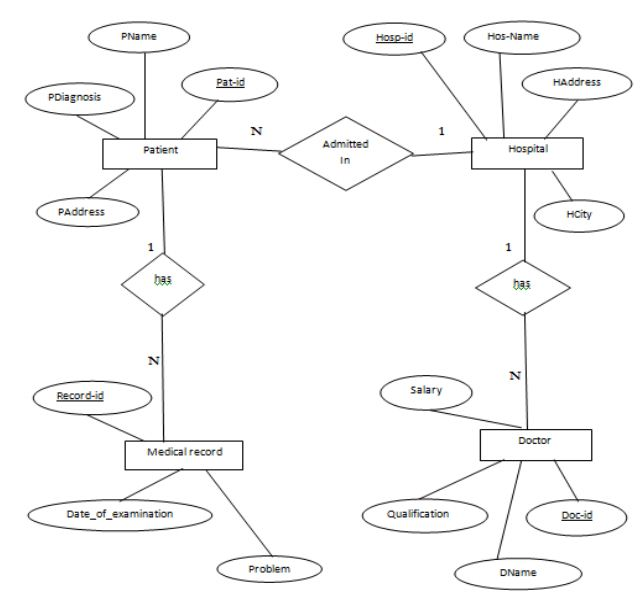
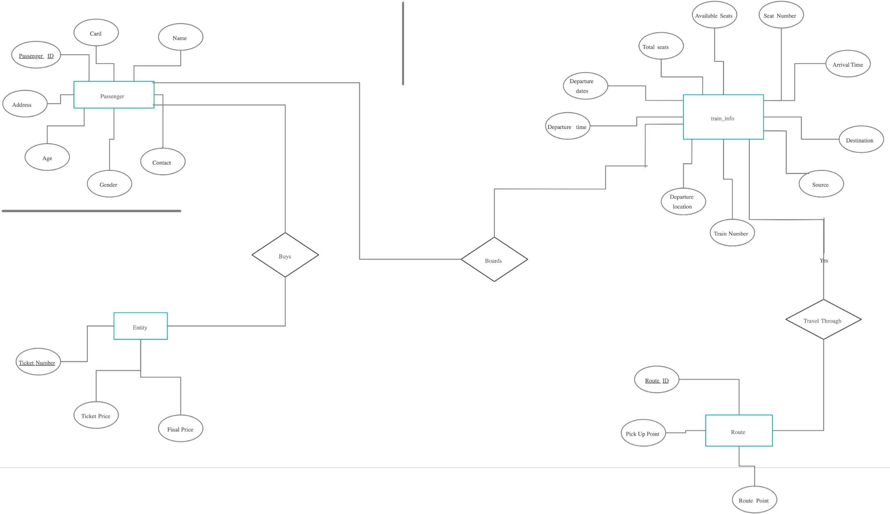
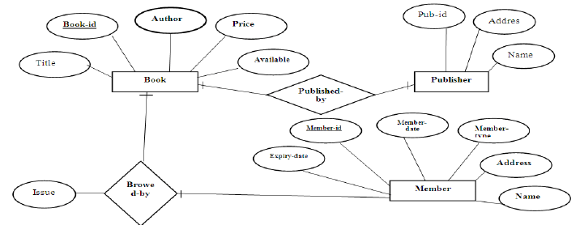
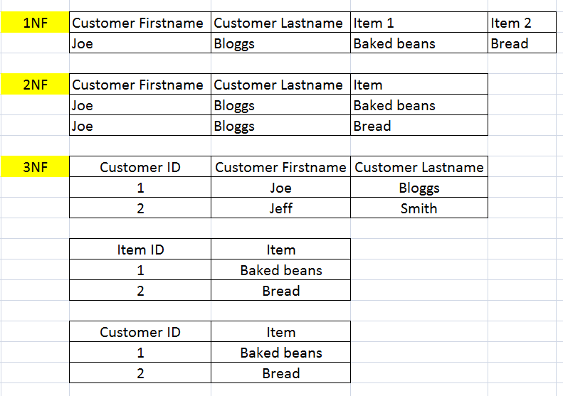

# EXAM IS OVER !!!!!
# EXAM IS OVER !!!!!
# EXAM IS OVER !!!!!
# EXAM IS OVER !!!!!
# EXAM IS OVER !!!!!
----
----
----

# Syllabus

Introduction to Data Management and Data Mining

Introduction to data management, Characteristics of databases, File 
system V/s Database system, Users of a Database System, Data 
Models, Schemas, and Instances, Database Administrator (DBA), 
Role of a DBA 
Introduction to Data Mining; Kind of pattern to be mined; 
Technologies used; Kind of applications targeted, Major issues in 
Data Mining 

Entity– Relationship Data Model

Conceptual Modelling of a database,The Entity-Relationship (ER) 
Model, Entity Types, Entity Sets, Attributes, and Keys, 
Relationship Types, Relationship Sets, Weak Entity Types 
Generalization, Specialization and Aggregation, Extended Entity 
Relationship (EER) Model, build ER model using SQL Server 
Management Studio(SSMS) 
3
Relational Databases and SQL

Relational database fundamentals
SQL (Structured Query Language) basics: Data Definition 
Language, Data Manipulation Language, Data Control Language, 
Transaction Control Language
Advanced SQL concepts: subqueries, joins, views, and transactions
Relational database design and normalization (1NF, 2NF, 3NF, 
BCNF)

Data Exploration and Data Preprocessing 

 Types of Attributes; Statistical Description of Data; Data 
Visualization; Measuring similarity and Dissimilarity; 
Why Preprocessing? Data Cleaning; Data Integration; Data 
Reduction: Attribute subset selection, Histograms, Clustering and 
Sampling; Data Transformation & Data Discretization: 
Normalization, Binning, Histogram Analysis and Concept 
Hierarchy generation 

Data Mining Techniques

Classification Methods; Decision Tree Induction, Bayesian 
Classification, Rule based classification
Cluster Analysis; Partitioning Methods, Hierarchical Methods, 
Outliers and Outlier Detection Methods
Association Mining Rules: Frequent item set Mining Methods 

Tools and Case Study

Business Intelligence (BI) tools (Tableau and Power BI), 
Apache Mahout
Case Study: Reporting Data mining for business applications like 
fraud detection, Clickstream mining, banking & finance, CRM etc.
Database for E-commerce, Database Design for a University 
System, Healthcare Information Management System


----
----

----
----
----

# Chapter 1

----
## 2 Markers C1
----


Define the role of a
Database
Administrator (DBA).

-----

1. **Role of a Database Administrator (DBA):**
   - A Database Administrator (DBA) is responsible for managing, maintaining, and securing databases within an organization. Their role includes tasks such as:
     - Database Design: Designing the structure and layout of databases to ensure efficiency and reliability.
     - Data Security: Implementing security measures to protect sensitive information from unauthorized access.
     - Performance Tuning: Monitoring and optimizing database performance to ensure fast and efficient operations.
     - Backup and Recovery: Creating and managing backups of databases to prevent data loss in case of system failures.
     - User Management: Managing user access and permissions to databases, ensuring that users have appropriate levels of access.
     - Troubleshooting: Identifying and resolving issues with databases, such as performance bottlenecks or data corruption.
------
------
------
------


Explain the types of
patterns to be mined
in Data Mining.

-----
2. **Types of Patterns to be Mined in Data Mining:**
   - Data Mining aims to discover various patterns and relationships within large datasets. Some common types of patterns include:
     - Association Patterns: Identifying relationships or associations between different variables or items in a dataset. For example, discovering that customers who buy product A are also likely to buy product B.
     - Classification Patterns: Predicting the class or category of new data instances based on past observations. For instance, classifying emails as spam or non-spam based on their content.
     - Clustering Patterns: Grouping similar data instances into clusters or segments based on their attributes or characteristics. For example, clustering customers based on their purchasing behavior.
     - Sequential Patterns: Finding patterns that occur over time or sequences of events. For instance, identifying the sequence of web pages visited by users on a website.

-----
-----
-----


Describe Traditional
File Systems. Support
your answer with
suitable example.

---


3. **Traditional File Systems:**
   - Traditional file systems store data in files and folders without any organizational structure or relationship between the data elements. For example, in a file system, files such as documents, images, and videos are stored in directories or folders.
   - Traditional file systems lack the ability to enforce data integrity and relationships between different data entities. For instance, in a file system, there is no built-in mechanism to ensure that related data is consistent and up-to-date across multiple files.
   - Retrieving and managing data in traditional file systems can be cumbersome and inefficient, especially when dealing with large volumes of data or complex data relationships.

----
----
----
----


List the users of
database system.

---


4. **Users of Database Systems:**
   - Database systems cater to various users with different roles and responsibilities, including:
     - Database Administrators (DBAs): Responsible for managing and maintaining the database system.
     - Database Developers: Involved in designing, implementing, and modifying database structures and applications.
     - End Users: Individuals who interact with the database system to retrieve, input, or manipulate data to support their daily tasks.
     - System Analysts: Responsible for analyzing user requirements and translating them into database specifications.
     - Database Designers: Involved in designing the logical and physical structure of the database based on user requirements and business needs.

----
----
----
----

Summarize the
technologies used in
Data Mining.

---


5. **Technologies Used in Data Mining:**
   - Data Mining employs various technologies and techniques to extract meaningful insights from large datasets, including:
     - Machine Learning Algorithms: Algorithms such as decision trees, neural networks, and support vector machines are used to analyze data and uncover patterns.
     - Statistical Analysis: Statistical methods and techniques are applied to identify correlations, trends, and anomalies in the data.
     - Data Visualization: Tools and techniques for visualizing data, such as charts, graphs, and dashboards, are used to gain insights and communicate findings effectively.
     - Data Warehousing: Data mining often relies on data warehouses or data marts, which are centralized repositories of integrated data from multiple sources.
     - Big Data Technologies: Data mining techniques are often applied to large-scale datasets using technologies such as Hadoop, Spark, and NoSQL databases.


---
---
---


Distinguish between
data and information.

---


6. **Difference between Data and Information:**
   - Data refers to raw facts, figures, or observations that have not been processed or analyzed. For example, a list of numbers or text strings extracted from a database.
   - Information, on the other hand, is data that has been processed, organized, or interpreted to provide meaning or context. For instance, a summary report, chart, or graph derived from analyzing the raw data.
   - In essence, data becomes information when it is analyzed and interpreted in a meaningful way to support decision-making or understanding of a particular phenomenon or situation.

---
---
---


Give examples of
Database Systems

----


7. **Examples of Database Systems:**
   - Some examples of database systems include:
     - MySQL: An open-source relational database management system (RDBMS) widely used for web applications.
     - Oracle Database: A commercial RDBMS developed by Oracle Corporation, known for its scalability and reliability.
     - Microsoft SQL Server: A relational database management system developed by Microsoft, commonly used for enterprise applications.
     - MongoDB: A NoSQL database system that stores data in flexible, JSON-like documents, suitable for handling unstructured or semi-structured data.
     - PostgreSQL: An open-source object-relational database system known for its robust feature set and extensibility.

These answers provide a concise yet comprehensive overview of each topic.


-----
-----
-----
-----
## 5 Marker C1
----
----

Explain the differences between data models, schemas, and instances in the context of database systems.


Analyze the advantages and disadvantages of database systems compared to traditional file systems, considering factors such as data integrity, scalability, and ease of access.


Describe Major issues in Data Mining(Include real world examples)


Demonstrate how different data models are applied in real-world database systems.


Compare and contrast characteristics of databases with those of traditional file systems.


Explain the types of patterns to be mined in Data Mining.


Discuss the application of Data Mining.


-----
-----
-----
-----
## 10 Marker C1
----
----


A company has recently migrated its data management system from a traditional file system to a database system. As the newly appointed Database Administrator (DBA), outline the steps you would take to ensure a smooth transition and discuss the potential benefits of this migration.


---

**Transitioning from Traditional File System to Database System:**

As the newly appointed Database Administrator (DBA), ensuring a smooth transition from a traditional file system to a database system requires careful planning, execution, and monitoring. Here's a structured outline of the steps I would take:

1. **Assessment and Planning:**
   - Conduct a comprehensive assessment of the current data management system, including the structure of data files, storage mechanisms, access controls, and security measures.
   - Identify the goals and objectives of migrating to a database system, such as improving data integrity, increasing scalability, enhancing data security, and enabling better data analysis and reporting.
   - Develop a detailed migration plan outlining the steps, timeline, resources, and stakeholders involved in the transition process.

2. **Database Design and Implementation:**
   - Design the database schema based on the organization's requirements, data model, and business processes. This involves identifying entities, attributes, relationships, and constraints.
   - Select an appropriate database management system (DBMS) based on factors such as functionality, scalability, compatibility, and budget.
   - Install and configure the chosen DBMS, ensuring optimal performance, security, and reliability.
   - Develop and implement scripts or migration tools to transfer data from the existing file system to the database system while maintaining data integrity and consistency.

3. **Data Migration and Validation:**
   - Execute the data migration process according to the migration plan, ensuring minimal disruption to ongoing operations.
   - Validate the migrated data to ensure accuracy, completeness, and consistency. This involves comparing data in the database system with data in the traditional file system, performing data integrity checks, and resolving any discrepancies or errors.
   - Conduct thorough testing and validation of database functionality, including data retrieval, insertion, updating, and deletion operations.

4. **Training and Knowledge Transfer:**
   - Provide training and support to users and stakeholders on the use of the new database system, including navigating the user interface, querying data, and performing common tasks.
   - Document best practices, guidelines, and procedures for database administration, data management, and system maintenance.
   - Foster a culture of continuous learning and improvement by encouraging feedback, addressing user concerns, and offering ongoing support and training opportunities.

5. **Monitoring and Optimization:**
   - Implement monitoring tools and processes to track database performance, resource utilization, and user activity.
   - Monitor system logs, error messages, and alerts to identify and address potential issues or bottlenecks proactively.
   - Continuously optimize database performance by fine-tuning configuration settings, indexing strategies, query optimization, and hardware upgrades as needed.

**Potential Benefits of Migration:**

1. **Improved Data Integrity:** Database systems offer built-in mechanisms for enforcing data integrity constraints such as primary keys, foreign keys, and referential integrity, reducing the risk of data inconsistencies and errors.

2. **Enhanced Scalability:** Database systems are designed to handle large volumes of data and support concurrent access by multiple users, making them suitable for scaling as the organization grows.

3. **Increased Security:** Database systems provide robust security features such as access control, authentication, encryption, and auditing, helping to protect sensitive data from unauthorized access, manipulation, or theft.

4. **Better Data Analysis and Reporting:** Database systems support advanced querying, analysis, and reporting capabilities, enabling users to extract valuable insights, trends, and patterns from the data for informed decision-making.

5. **Streamlined Data Management:** Database systems offer centralized data storage, management, and retrieval, reducing the complexity and overhead associated with managing data across multiple files or systems.

6. **Faster Access and Retrieval:** Database systems employ indexing, caching, and optimization techniques to facilitate faster data access and retrieval, improving the responsiveness and efficiency of applications and services.

7. **Compliance and Regulatory Compliance:** Database systems help organizations comply with industry regulations, data privacy laws, and compliance standards by implementing controls, audit trails, and data protection measures.

In conclusion, migrating from a traditional file system to a database system involves careful planning, execution, and monitoring to ensure a smooth transition. The potential benefits of this migration include improved data integrity, enhanced scalability, increased security, better data analysis and reporting, streamlined data management, faster access and retrieval, and compliance with regulatory requirements. As the DBA, I would be committed to maximizing these benefits while minimizing disruptions and risks during the transition process.

---
---
---
---
A healthcare organization is exploring the implementation of data mining techniques to improve patient care and optimize resource allocation. Describe the process of selecting appropriate data mining technologies and outline potential applications in healthcare analytics.

-----

**Selecting Appropriate Data Mining Technologies for Healthcare:**

1. **Needs Assessment:**
   - Conduct a thorough needs assessment to understand the specific challenges and objectives of the healthcare organization, such as improving patient outcomes, reducing costs, enhancing operational efficiency, and optimizing resource allocation.
   - Identify the types of data available within the organization, including electronic health records (EHRs), medical imaging data, patient demographics, billing and claims data, and administrative data.

2. **Data Preprocessing and Integration:**
   - Preprocess and integrate diverse datasets from multiple sources to create a unified data repository for analysis.
   - Cleanse and transform data to ensure consistency, accuracy, and completeness, addressing issues such as missing values, outliers, and data inconsistencies.
   - Apply techniques such as data normalization, feature engineering, and dimensionality reduction to prepare the data for mining.

3. **Algorithm Selection:**
   - Consider the specific objectives and requirements of the healthcare organization when selecting data mining algorithms.
   - Choose algorithms that are suitable for the types of patterns or insights sought, such as classification, clustering, regression, association rule mining, or anomaly detection.
   - Evaluate the scalability, performance, interpretability, and computational requirements of different algorithms to ensure they meet the organization's needs.

4. **Model Development and Evaluation:**
   - Develop predictive or descriptive models using selected algorithms and techniques.
   - Split the data into training and testing sets to evaluate model performance and generalization ability.
   - Use metrics such as accuracy, precision, recall, F1-score, and area under the ROC curve (AUC) to assess model performance and compare different algorithms.
   - Validate models using techniques such as cross-validation, bootstrapping, or holdout validation to ensure robustness and reliability.

5. **Implementation and Integration:**
   - Implement data mining models into the existing healthcare analytics infrastructure, such as electronic health record (EHR) systems, clinical decision support systems (CDSS), or business intelligence (BI) platforms.
   - Integrate predictive models or insights into clinical workflows to support healthcare providers in decision-making processes.
   - Ensure interoperability and compatibility with existing IT systems and data standards to facilitate seamless integration and adoption.

**Potential Applications in Healthcare Analytics:**

1. **Clinical Decision Support Systems (CDSS):**
   - Develop predictive models to assist healthcare providers in diagnosing diseases, predicting patient outcomes, and recommending personalized treatment plans.
   - Use classification algorithms to identify patients at risk of developing chronic conditions or complications, enabling early intervention and preventive care.

2. **Disease Surveillance and Public Health Monitoring:**
   - Apply clustering techniques to identify disease clusters or outbreaks within a population, enabling timely public health interventions and resource allocation.
   - Use spatial analysis and geographic information systems (GIS) to visualize and analyze patterns of disease spread and transmission.

3. **Healthcare Resource Management:**
   - Use predictive analytics to forecast patient demand for healthcare services, hospital admissions, and bed occupancy rates, enabling proactive resource allocation and capacity planning.
   - Apply optimization techniques to optimize staff scheduling, equipment utilization, and inventory management, reducing costs and improving operational efficiency.

4. **Patient Engagement and Personalized Medicine:**
   - Develop recommendation systems to provide personalized health recommendations, treatment plans, and lifestyle interventions based on individual patient preferences, demographics, and health data.
   - Use association rule mining to identify correlations between patient characteristics, genetic markers, and treatment responses, enabling personalized medicine and precision healthcare interventions.

5. **Healthcare Fraud Detection and Billing Compliance:**
   - Apply anomaly detection algorithms to identify suspicious patterns of healthcare fraud, waste, and abuse in billing and claims data, reducing financial losses and improving billing compliance.
   - Use predictive modeling to forecast healthcare utilization patterns and detect aberrant billing practices, enabling proactive monitoring and investigation of fraudulent activities.

In conclusion, selecting appropriate data mining technologies for healthcare involves understanding the organization's objectives, preprocessing and integrating diverse datasets, selecting suitable algorithms, developing and evaluating models, and implementing insights into clinical workflows. Potential applications in healthcare analytics include clinical decision support, disease surveillance, resource management, patient engagement, personalized medicine, and fraud detection. By leveraging data mining techniques, healthcare organizations can improve patient care, optimize resource allocation, and enhance operational efficiency.


-----
-----
Analyze the impact of data mining on decision-making processes in various industries, citing specific examples to illustrate its practical applications and potential benefits.


-----

**Impact of Data Mining on Decision-Making Processes Across Industries:**

Data mining has revolutionized decision-making processes across various industries by extracting valuable insights from vast amounts of data. Here's an analysis of its impact, along with specific examples demonstrating practical applications and potential benefits:

1. **Retail Industry:**
   - *Practical Application:* Retailers use data mining to analyze customer purchase patterns, preferences, and behaviors to optimize marketing strategies and personalize customer experiences.
   - *Example:* Amazon employs data mining techniques to recommend products to customers based on their browsing history, purchase history, and demographic information, resulting in increased sales and customer satisfaction.

2. **Healthcare Industry:**
   - *Practical Application:* Healthcare providers leverage data mining to analyze electronic health records (EHRs), medical imaging data, and clinical trial data to improve patient care, disease management, and treatment outcomes.
   - *Example:* IBM Watson Health applies data mining algorithms to analyze medical literature, patient records, and genomic data to assist healthcare providers in diagnosing diseases, recommending treatment options, and predicting patient outcomes, leading to more accurate diagnoses and personalized treatment plans.

3. **Financial Services Industry:**
   - *Practical Application:* Financial institutions use data mining to detect fraudulent activities, assess credit risk, and identify profitable investment opportunities.
   - *Example:* PayPal employs data mining techniques to analyze transactional data and user behavior patterns to detect and prevent fraudulent transactions in real-time, minimizing financial losses and enhancing security for users.

4. **Manufacturing Industry:**
   - *Practical Application:* Manufacturers utilize data mining to optimize production processes, forecast demand, and improve product quality.
   - *Example:* General Electric (GE) applies data mining algorithms to analyze sensor data from industrial machines and equipment to predict equipment failures, schedule maintenance proactively, and minimize downtime, resulting in cost savings and increased operational efficiency.

5. **Telecommunications Industry:**
   - *Practical Application:* Telecommunications companies leverage data mining to analyze customer usage patterns, predict churn, and optimize network performance.
   - *Example:* T-Mobile uses data mining techniques to analyze customer call records, text messages, and data usage patterns to personalize marketing offers, retain customers, and improve network coverage, resulting in increased customer loyalty and reduced churn rates.

**Potential Benefits of Data Mining in Decision-Making:**

1. **Improved Decision Accuracy:** Data mining enables organizations to make data-driven decisions based on objective analysis and insights, reducing the risk of errors or biases associated with intuition or gut feeling.

2. **Cost Reduction:** By identifying inefficiencies, optimizing processes, and detecting fraud or anomalies, data mining helps organizations reduce costs, improve resource allocation, and increase operational efficiency.

3. **Enhanced Customer Experience:** By analyzing customer behavior, preferences, and feedback, data mining enables organizations to personalize products, services, and marketing campaigns, leading to improved customer satisfaction and loyalty.

4. **Increased Revenue:** By identifying new market opportunities, predicting customer demand, and optimizing pricing strategies, data mining helps organizations increase sales, revenue, and profitability.

5. **Risk Management:** Data mining assists organizations in assessing and mitigating risks associated with fraud, credit defaults, market fluctuations, and operational disruptions, enabling proactive risk management and decision-making.

In conclusion, data mining plays a crucial role in enhancing decision-making processes across industries by providing actionable insights, optimizing resource allocation, improving operational efficiency, and enhancing customer experiences. Its practical applications and potential benefits are diverse and far-reaching, making it an indispensable tool for organizations seeking to gain a competitive edge in today's data-driven world.


-----
-----
-----
Summarize the fundamental characteristics of databases and their significance in modern data management practices.


-----

**Fundamental Characteristics of Databases:**

1. **Structure and Organization:**
   - Databases organize data in a structured manner using tables, records, and fields, enabling efficient storage, retrieval, and manipulation of information.
   - Data is organized according to predefined schemas, which define the structure, relationships, and constraints of the data elements.

2. **Persistence:**
   - Databases are designed to persistently store data, ensuring that it remains accessible and consistent over time, even in the event of system failures or shutdowns.
   - Changes to data are durable and permanent, maintaining data integrity and reliability.

3. **Concurrency Control:**
   - Databases support concurrent access by multiple users or applications, ensuring that data remains consistent and accurate even during simultaneous transactions.
   - Concurrency control mechanisms such as locking, transactions, and isolation levels prevent data conflicts and maintain data integrity.

4. **Data Independence:**
   - Databases provide a layer of abstraction between the physical storage of data and its logical representation, allowing applications to interact with data independently of its underlying storage structures.
   - Changes to the database schema or physical storage do not impact the applications or users accessing the data, promoting flexibility and scalability.

5. **Security and Access Control:**
   - Databases enforce security measures to protect data from unauthorized access, manipulation, or disclosure.
   - Access control mechanisms such as user authentication, authorization, and encryption ensure that only authorized users can access and modify sensitive data.

6. **Scalability and Performance:**
   - Databases are designed to scale to accommodate increasing data volumes, users, and workload demands.
   - Performance optimization techniques such as indexing, caching, and query optimization ensure fast and efficient data retrieval and processing.

7. **Data Integrity and Consistency:**
   - Databases enforce data integrity constraints such as primary keys, foreign keys, and check constraints to maintain data consistency and accuracy.
   - Transactions ensure that changes to the database occur in a consistent and reliable manner, with support for atomicity, consistency, isolation, and durability (ACID) properties.

**Significance in Modern Data Management Practices:**

1. **Centralized Data Repository:**
   - Databases serve as centralized repositories for storing, managing, and organizing large volumes of data from diverse sources, facilitating data integration and sharing across the organization.

2. **Data Analysis and Decision Making:**
   - Databases provide a foundation for data analysis, reporting, and decision-making processes, enabling organizations to derive insights, identify trends, and make informed decisions based on accurate and timely information.

3. **Support for Business Operations:**
   - Databases support critical business operations such as transaction processing, inventory management, customer relationship management (CRM), and supply chain management, ensuring the efficient and reliable functioning of business processes.

4. **Regulatory Compliance:**
   - Databases help organizations comply with regulatory requirements, data privacy laws, and industry standards by enforcing data security, access control, and audit trails, ensuring that sensitive information is protected and managed in accordance with legal and regulatory mandates.

5. **Enhanced Customer Experience:**
   - Databases enable organizations to personalize products, services, and marketing campaigns based on customer preferences, behaviors, and purchase history, leading to improved customer satisfaction, loyalty, and retention.

6. **Innovation and Competitive Advantage:**
   - Databases serve as a foundation for innovation and competitive advantage, enabling organizations to develop new products, services, and business models by leveraging data-driven insights, predictive analytics, and machine learning algorithms.

In summary, databases play a crucial role in modern data management practices by providing a structured, persistent, and secure environment for storing, organizing, and analyzing data. Their fundamental characteristics ensure data integrity, accessibility, and scalability, making them indispensable tools for organizations seeking to leverage data for strategic decision-making, operational efficiency, and competitive advantage in today's data-driven economy.

-----
-----
-----

Evaluate the importance of data normalization techniques in database design, explaining how they contribute to data integrity, efficiency, and scalability.


----


**Importance of Data Normalization Techniques in Database Design:**

Data normalization is a crucial process in database design that involves organizing data into tables and eliminating redundancy and dependency, ensuring data integrity, efficiency, and scalability. Let's evaluate its importance:

1. **Data Integrity:**
   - By eliminating redundant data and organizing it into separate tables based on functional dependencies, normalization reduces the risk of data anomalies such as update anomalies, insertion anomalies, and deletion anomalies.
   - Normalization ensures that each piece of data is stored in only one place, minimizing the likelihood of inconsistencies or contradictions that can arise when the same data is stored redundantly in multiple locations.

2. **Efficiency:**
   - Normalized databases are typically more efficient in terms of storage space and query performance compared to denormalized databases.
   - By reducing data duplication and redundancy, normalization minimizes storage requirements, resulting in smaller database sizes and lower storage costs.
   - Normalized databases also tend to perform better in terms of query execution, as they require fewer joins and can utilize more efficient indexing strategies.

3. **Scalability:**
   - Normalization facilitates scalability by reducing data duplication and ensuring that database structures are well-organized and adaptable to changing requirements.
   - As the size and complexity of the database grow, normalized structures make it easier to add new data elements, modify existing tables, and accommodate evolving business needs without introducing inconsistencies or disruptions.

4. **Data Consistency and Accuracy:**
   - Normalization promotes data consistency and accuracy by enforcing integrity constraints such as primary keys, foreign keys, and referential integrity.
   - By maintaining a single source of truth for each piece of data, normalization ensures that updates, inserts, and deletions are applied consistently across related tables, preventing data inconsistencies and ensuring data accuracy.

5. **Simplified Maintenance:**
   - Normalized databases are typically easier to maintain and modify over time compared to denormalized databases.
   - Changes to the database schema, such as adding new tables or modifying existing relationships, can be implemented more smoothly in a normalized structure without impacting data integrity or application functionality.

In conclusion, data normalization techniques play a crucial role in database design by promoting data integrity, efficiency, and scalability. By organizing data into well-structured tables and eliminating redundancy and dependency, normalization ensures that databases are optimized for storage, performance, and maintenance, enabling organizations to leverage their data effectively for decision-making, analysis, and innovation.


Summary 

Advantages of Normalization

    Normalization helps to minimize data redundancy.
    Greater overall database organization.
    Data consistency within the database.
    Much more flexible database design.
    Enforces the concept of relational integrity.

Disadvantages of Normalization

    You cannot start building the database before knowing what the user needs.
    The performance degrades when normalizing the relations to higher normal forms, i.e., 4NF, 5NF.
    It is very time-consuming and difficult to normalize relations of a higher degree.
    Careless decomposition may lead to a bad database design, leading to serious problems.


----
----
----


Discuss the major issues encountered in data mining projects, including data quality, scalability, and interpretability, and propose strategies for addressing these challenges effectively.


----

**Major Issues Encountered in Data Mining Projects:**

1. **Data Quality:**
   - *Issue:* Poor data quality, including missing values, outliers, noise, and inconsistencies, can lead to inaccurate or biased results and undermine the effectiveness of data mining models.
   - *Impact:* Reduced model accuracy, reliability, and trustworthiness, resulting in suboptimal decision-making and resource allocation.
   
2. **Scalability:**
   - *Issue:* Handling large volumes of data efficiently and effectively, especially in big data environments, can pose scalability challenges, impacting model training, evaluation, and deployment.
   - *Impact:* Increased computational complexity, longer processing times, and scalability limitations, hindering the scalability and performance of data mining solutions.
   
3. **Interpretability:**
   - *Issue:* Complex and opaque data mining models, such as deep learning neural networks, may lack interpretability, making it difficult for stakeholders to understand how decisions are made and trust the model outputs.
   - *Impact:* Limited transparency, accountability, and usability of data mining models, leading to skepticism, resistance, and adoption barriers among users and decision-makers.
   
4. **Bias and Fairness:**
   - *Issue:* Data mining models may inadvertently perpetuate or amplify biases present in the training data, resulting in unfair or discriminatory outcomes, especially in sensitive domains such as healthcare or finance.
   - *Impact:* Unfair treatment of certain groups or individuals, ethical concerns, legal ramifications, and damage to organizational reputation and trust.
   
5. **Feature Selection and Engineering:**
   - *Issue:* Identifying relevant features and engineering informative representations from raw data is a critical yet challenging task in data mining projects, especially in high-dimensional datasets.
   - *Impact:* Suboptimal model performance, overfitting, and model complexity, leading to reduced generalization ability and interpretability.
   
**Strategies for Addressing These Challenges Effectively:**

1. **Data Quality Assurance:**
   - Conduct thorough data quality assessment and preprocessing steps, including data cleaning, normalization, imputation of missing values, outlier detection, and error correction.
   - Implement data validation checks, quality controls, and data governance practices to ensure data integrity, consistency, and completeness throughout the data mining lifecycle.
   
2. **Scalability Solutions:**
   - Leverage distributed computing frameworks such as Apache Spark or Hadoop for parallel processing and distributed storage of large-scale datasets, enabling efficient and scalable data mining operations.
   - Utilize sampling techniques, data partitioning, and incremental learning approaches to manage computational complexity and handle data streams or incremental updates.
   
3. **Model Interpretability Techniques:**
   - Employ transparent and interpretable models such as decision trees, logistic regression, or rule-based systems, which provide explicit rules or explanations for decision-making.
   - Utilize post-hoc interpretability methods such as feature importance analysis, partial dependence plots, or model-agnostic techniques (e.g., LIME or SHAP) to explain and visualize model predictions.
   
4. **Bias Mitigation Strategies:**
   - Conduct bias audits and fairness assessments to identify and mitigate biases in training data and model predictions, ensuring fairness, equity, and accountability.
   - Implement fairness-aware algorithms, bias correction techniques, and adversarial training approaches to mitigate bias and promote fairness in data mining models.
   
5. **Feature Selection and Engineering Best Practices:**
   - Employ feature selection algorithms, dimensionality reduction techniques, and domain knowledge to identify informative features and reduce the dimensionality of high-dimensional datasets.
   - Use domain-specific feature engineering techniques, such as text mining, image processing, or time series analysis, to extract meaningful representations from raw data and improve model performance.

By addressing these challenges proactively and systematically, data mining projects can overcome obstacles related to data quality, scalability, interpretability, bias, and feature engineering, enabling organizations to derive valuable insights and make informed decisions from their data.

----
----
----

Assess the role of metadata in organizing and managing data effectively within a database system, discussing its significance in facilitating data analysis and retrieval processes.


**Role of Metadata in Organizing and Managing Data Effectively:**

Metadata plays a crucial role in organizing and managing data within a database system by providing descriptive information about the structure, content, and context of the data. Let's assess its significance:

1. **Data Organization and Structure:**
   - Metadata describes the structure of the database, including tables, columns, data types, relationships, and constraints.
   - It helps database administrators and developers understand the organization of data elements, ensuring consistency and coherence in database design and implementation.

2. **Data Content and Context:**
   - Metadata provides information about the content and context of data, including data definitions, descriptions, and annotations.
   - It helps users understand the meaning and interpretation of data elements, facilitating data understanding, communication, and collaboration among stakeholders.

3. **Data Lineage and Provenance:**
   - Metadata tracks the lineage and provenance of data, documenting its origin, history, transformations, and dependencies.
   - It helps trace the flow of data across different stages of data processing, ensuring data quality, reliability, and auditability.

4. **Data Access and Security:**
   - Metadata describes access controls, permissions, and security policies associated with data, including user privileges, roles, and authentication mechanisms.
   - It helps enforce data security and privacy policies, ensuring that sensitive data is protected and accessed only by authorized users.

5. **Data Integration and Interoperability:**
   - Metadata facilitates data integration and interoperability by providing information about data sources, formats, and semantics.
   - It enables seamless exchange and integration of data across disparate systems, applications, and platforms, promoting data sharing and reuse.

**Significance of Metadata in Facilitating Data Analysis and Retrieval Processes:**

1. **Data Discovery and Exploration:**
   - Metadata provides descriptive information about data attributes, allowing users to discover and explore relevant datasets based on their characteristics, such as data type, format, or topic.
   - It helps users identify and access datasets of interest quickly and efficiently, enabling exploratory data analysis and hypothesis generation.

2. **Query Optimization and Execution:**
   - Metadata stores statistics, indexes, and query execution plans, enabling the database optimizer to generate efficient query execution plans based on data distribution, cardinality, and access patterns.
   - It helps optimize query performance by selecting the most appropriate access methods, join algorithms, and optimization strategies, reducing query processing times and resource consumption.

3. **Data Lineage and Impact Analysis:**
   - Metadata tracks the lineage and dependencies of data elements, enabling users to trace the origins and transformations of data and understand its impact on downstream processes.
   - It helps analyze the effects of changes to data structures, schema modifications, or data cleansing operations, ensuring data consistency and integrity.

4. **Data Governance and Compliance:**
   - Metadata provides information about data usage, ownership, and compliance requirements, enabling organizations to enforce data governance policies and regulatory compliance.
   - It helps track data usage patterns, monitor access logs, and audit data activities to ensure adherence to data privacy laws, security regulations, and industry standards.

5. **Data Documentation and Annotation:**
   - Metadata documents the context, semantics, and usage guidelines of data elements, providing valuable insights for data analysis and interpretation.
   - It helps users understand the meaning and interpretation of data attributes, reducing ambiguity and facilitating accurate data analysis, interpretation, and decision-making.

In conclusion, metadata plays a critical role in organizing and managing data effectively within a database system, providing descriptive information about the structure, content, context, lineage, and usage of data. Its significance in facilitating data analysis and retrieval processes lies in enabling data discovery, query optimization, impact analysis, governance, compliance, and documentation, ultimately enhancing the usability, accessibility, and reliability of data for decision-making and insight generation.

----


----
----
----
----
----
----
----
----

# Chapter 2 


----
----
----
## 2 Markers C2


----
----
----
----


Define the Entity-Relationship (ER) model and explain its role in database design.

----
----

1. **Define the Entity-Relationship (ER) model and explain its role in database design.**
   - The Entity-Relationship (ER) model is a conceptual data model used to represent the relationships between entities in a database. It defines entities as objects or things in the real world and specifies the relationships between them.
   - The ER model helps in visualizing the structure of a database by representing entities as rectangles, attributes as ovals, and relationships as lines connecting entities.
   - Its role in database design is to provide a clear and concise representation of the data requirements and relationships within an organization, serving as a blueprint for designing the database schema.

-----
-----
-----

Differentiate between entity types and entity sets in the context of the ER model.


-----
-----
2. **Differentiate between entity types and entity sets in the context of the ER model.**
   - Entity Type: An entity type represents a collection of similar entities sharing the same attributes. It defines the properties and behavior of entities of a particular type.
   - Entity Set: An entity set is a collection of instances of an entity type at a particular point in time. It represents the actual data stored in the database.
   - In essence, an entity type is a template or blueprint for entities, while an entity set is the actual collection of instances of that entity type.


----
----
----
----

Justify the need of ER diagrams in DBMS.

----
----
----


3. **Justify the need of ER diagrams in DBMS.**
   - ER diagrams provide a visual representation of the database schema, including entities, attributes, and relationships, which helps in better understanding the database structure.
   - They serve as a communication tool between stakeholders, such as database designers, developers, and end-users, facilitating discussions and clarifying requirements.
   - ER diagrams aid in identifying potential design flaws, such as redundancy, inconsistency, or missing relationships, early in the design phase, leading to a more robust database design.
   - They serve as a documentation tool for documenting the database schema, making it easier to maintain and update the database over time.

----
----
----

Describe the terms entity and entity sets.

----
----
----


4. **Describe the terms entity and entity sets.**
   - Entity: An entity represents a real-world object or concept, such as a person, place, thing, or event, that can be uniquely identified and described. Entities have attributes that describe their properties or characteristics.
   - Entity Set: An entity set is a collection of similar entities sharing the same attributes. It represents the set of all instances of an entity type at a particular point in time.


----
----
----


List attributes of DBMS

----
----
----

5. **List attributes of DBMS.**
   - Attributes of a DBMS include:
     1. Data Storage
     2. Data Retrieval
     3. Data Manipulation
     4. Data Security
     5. Data Integrity
     6. Concurrency Control
     7. Backup and Recovery
     8. Database Administration
     9. Query Optimization
     10. Data Dictionary Management


----
----
----


Outline different types of keys in DBMS

-----
-----

6. **Outline different types of keys in DBMS.**
   - Different types of keys in DBMS include:
     1. Primary Key
     2. Foreign Key
     3. Candidate Key
     4. Super Key
     5. Alternate Key

-----
-----

Illustrate the degree of relationship case.

-----
-----


7. **Illustrate the degree of relationship case.**
   - The degree of relationship in a database refers to the number of entity types participating in a relationship. It can be unary, binary, ternary, etc., depending on the number of entity types involved.
   - For example, in a binary relationship between "Student" and "Course," the degree of relationship is binary because it involves two entity types: Student and Course.


----
----
----
----
## 5 Markers C2


----
----
----
----


Distinguish between strong and weak entity.


Explain composite and multivaled attributes with example.


Consider a relational database for a university with the following tables: Students: StudentID Name Age DepartmentID (Foreign Key) Departments: DepartmentID DepartmentName Identify the attributes in the "Students" and "Departments" tables.


You are tasked with designing a database schema for a university. The database needs to store information about students, courses, and departments. Consider a new table named "Courses" with the following attributes: CourseID CourseName DepartmentID (Foreign Key)  Identify and list potential candidate keys for the 'Courses' table.


Consider a database schema for a library management system with the following tables: Books: Columns: book_id, title, author, genre, year_published Members: Columns: member_id, name, email, phone Loans: Columns: loan_id, book_id, member_id, loan_date, return_date Write SQL queries for the following tasks:  1. Insert a new book into the Books table. Title: "The Great Gatsby", Author: "F. Scott Fitzgerald", Genre: "Fiction", Year Published: 1925.  2. Insert a new member into the Members table. Name: "Alice Johnson", Email: "alice@example.com", Phone: "123-456-7890".


Explain the concept of foreigh keys with example
Summarize the concept of composite keys with example


----
----
----
----
----
----
----
----
## 10 Markers C2
----
----
----


Illustrate in brief the concept of cardinality in DBMS with example.


----
----

**Illustrating Cardinality in DBMS:**

In database management systems (DBMS), cardinality refers to the uniqueness or uniqueness constraint of data values within a column or relationship between tables. It essentially describes the number of unique values that a column or relationship can contain. Understanding cardinality is crucial in database design as it influences the efficiency, integrity, and performance of the database schema.

**Understanding Cardinality:**

1. **One-to-One (1:1) Cardinality:**
   - In a one-to-one relationship, each record in one table is associated with exactly one record in another table.
   - Example: Consider a "Person" table with a unique "Social Security Number (SSN)" column. If each SSN corresponds to only one person, the relationship between the "Person" table and another table storing personal information (e.g., "Address") would be one-to-one.

2. **One-to-Many (1:N) Cardinality:**
   - In a one-to-many relationship, each record in one table can be associated with multiple records in another table, but each record in the second table can only be associated with one record in the first table.
   - Example: A "Department" table may have a one-to-many relationship with an "Employee" table, where each department can have multiple employees, but each employee belongs to only one department.

3. **Many-to-One (N:1) Cardinality:**
   - In a many-to-one relationship, multiple records in one table can be associated with a single record in another table.
   - Example: In a "Product" table and an "Order" table, each order can contain multiple products, but each product belongs to only one order, establishing a many-to-one relationship.

4. **Many-to-Many (M:N) Cardinality:**
   - In a many-to-many relationship, multiple records in one table can be associated with multiple records in another table.
   - Example: Consider a "Student" table and a "Course" table in a university database. A student can enroll in multiple courses, and each course can have multiple students enrolled, resulting in a many-to-many relationship between students and courses.

**Significance of Cardinality in DBMS:**

1. **Data Integrity:**
   - Cardinality constraints help maintain data integrity by defining the allowable relationships between tables, ensuring that data is logically consistent and accurate.

2. **Query Optimization:**
   - Understanding cardinality aids in query optimization by providing insights into the volume and distribution of data, allowing the query optimizer to generate efficient query execution plans.

3. **Normalization:**
   - Cardinality considerations play a role in database normalization, guiding the decomposition of tables to minimize redundancy and dependency and promote data integrity.

4. **Indexing and Performance:**
   - Cardinality influences the effectiveness of indexing strategies, with high cardinality columns often benefiting from indexing to improve query performance and data retrieval efficiency.

5. **Application Development:**
   - Cardinality constraints inform application developers about the nature of relationships between entities, guiding the design of data access methods, user interfaces, and business logic.

In conclusion, cardinality is a fundamental concept in DBMS that governs the relationships between tables and the uniqueness of data values. By understanding and appropriately managing cardinality, database designers can create efficient, scalable, and maintainable database schemas that meet the needs of the application and ensure data integrity and performance.


----
----
----


Describe in detail different types of database keys with suitable example.


----
----
----

**Describing Different Types of Database Keys:**

In database management systems (DBMS), keys are attributes or sets of attributes that uniquely identify rows (records) within a table. They play a crucial role in ensuring data integrity, facilitating data retrieval, and establishing relationships between tables. Here are the different types of database keys:

1. **Primary Key (PK):**
   - The primary key uniquely identifies each record in a table and ensures that there are no duplicate values.
   - Example: Consider a "Students" table with attributes such as StudentID, Name, and Age. If StudentID is designated as the primary key, each student will have a unique StudentID.

2. **Foreign Key (FK):**
   - A foreign key establishes a relationship between two tables by referencing the primary key of another table.
   - Example: In a "Orders" table, the CustomerID column may be a foreign key that references the primary key (CustomerID) in a "Customers" table, indicating which customer placed each order.

3. **Unique Key:**
   - A unique key constraint ensures that all values in a column or set of columns are unique, similar to a primary key. However, unlike a primary key, a unique key can allow null values.
   - Example: In an "Employees" table, the Email column may be defined as a unique key to ensure that each employee has a unique email address.

4. **Candidate Key:**
   - A candidate key is a set of one or more attributes that can uniquely identify each record in a table. It is a candidate for being selected as the primary key.
   - Example: In a "Products" table, both ProductID and SKU (Stock Keeping Unit) may be candidate keys, as each can uniquely identify a product.

5. **Composite Key:**
   - A composite key consists of multiple columns that together uniquely identify each record in a table.
   - Example: In a "Sales" table, a composite key may consist of OrderID and ProductID columns, ensuring that each combination of order and product is unique.

6. **Alternate Key:**
   - An alternate key is a candidate key that is not selected as the primary key. It represents an alternative unique identifier for records.
   - Example: In a "Books" table, ISBN (International Standard Book Number) may be an alternate key if BookID is chosen as the primary key.

7. **Surrogate Key:**
   - A surrogate key is an artificially generated unique identifier used as the primary key, typically when there is no natural key available or when performance considerations favor a surrogate key.
   - Example: In a "Students" table, a StudentID generated by an auto-incrementing sequence may serve as a surrogate key.

8. **Super Key:**
   - A super key is a set of one or more attributes that uniquely identify each record in a table. It may contain more attributes than necessary to uniquely identify records.
   - Example: In a "Customers" table, a super key may consist of CustomerID, Name, and Email, as this combination uniquely identifies each customer.

**Summary:**
Each type of database key serves a distinct purpose in database design, ensuring data integrity, establishing relationships between tables, and facilitating efficient data retrieval. By understanding the characteristics and usage scenarios of different keys, database designers can create well-structured and optimized database schemas that meet the requirements of their applications.


----
----
----


Draw ER diagram of Hospital management system. Convert the ER diagram to tables.


----
----
----



The image you sent depicts an Entity-Relationship (ER) diagram for a hospital management system. It illustrates the entities involved in the system, their attributes, and the relationships between them. Here’s a breakdown of the ER diagram:

* Entities:
  * Patient
  * Hospital
  * Doctor
  * Medical Record

* Attributes:
  * Patient: PName, PAddress, PDiagnosis, Pat-id
  * Hospital: Hosp-id, Hos-Name, HAddress, HCity
  * Doctor: Doc-id, DName, Qualification, Salary
  * Medical Record: Record-id, Date_of_examination, Problem

* Relationships:
  * A patient can be admitted to one hospital (1:N).
  * A hospital can have many patients admitted (N:1).
  * A doctor can have many medical records (1:N).
  * A medical record is associated with one doctor (N:1). 

Here’s how the ER diagram translates to tables in a relational database:

| Table Name | Attributes | Primary Key | Foreign Key |
|---|---|---|---|
| Patient | Pat-id, PName, PAddress, PDiagnosis | Pat-id | |
| Hospital | Hosp-id, Hos-Name, HAddress, HCity | Hosp-id | |
| Doctor | Doc-id, DName, Qualification, Salary | Doc-id | |
| Medical Record | Record-id, Date_of_examination, Problem, Doc-id, Pat-id | Record-id | Doc-id (references Doctor.Doc-id), Pat-id (references Patient.Pat-id) | 

----
----
----


Draw EER diagram of Railway Reservation system. Convert the ER diagram to tables.


----
----
----



Based on the image you provided, which is an ER diagram for a Railway Reservation System, here are the tables in a relational database:

| Table Name | Attributes | Primary Key | Foreign Key |
|---|---|---|---|
| Passenger | Passenger_ID, Passenger_Name, Age, Gender | Passenger_ID | |
| Train | Train_ID, Train_Name, Source_Station (references Station.Station_Name), Destination_Station (references Station.Station_Name), Departure_Date | Train_ID | |
| Station | Station_Name | Station_Name | |
| Ticket | Ticket_ID, Passenger_ID (references Passenger.Passenger_ID), Train_ID (references Train.Train_ID), Journey_Date, Seat_Number, Class, Fare | Ticket_ID | | 

Here's a breakdown of the tables and their relationships:

* **Passenger:** Stores information about passengers including their ID, name, age, and gender.
* **Train:** Stores information about trains including their ID, name, source station, destination station, and departure date. 
* **Station:** Stores the names of stations.
* **Ticket:** Stores ticketing information including the ticket ID, passenger ID (foreign key referencing Passenger.Passenger_ID), train ID (foreign key referencing Train.Train_ID), journey date, seat number, class (e.g., economy, business), and fare.

Some points to note:

* The ER diagram shows a many-to-many relationship between Train and Station. This is because a train can have many stations on its route, and a station can have many trains stopping by. In the tables, we don't explicitly represent this many-to-many relationship. Instead, we can create a separate table to link trains and stations if needed. 
* The  departure time attribute is missing from the Train table in the image you provided. You can include this attribute if it's relevant to your system.

----
----
----


Justify the need of EER in detail.


----
----
----

**Justifying the Need for Extended Entity-Relationship (EER) Model in Detail:**

The Extended Entity-Relationship (EER) model enhances the traditional Entity-Relationship (ER) model by incorporating additional concepts and constructs to represent more complex data relationships and constraints. The need for EER arises due to several factors:

1. **Complex Relationships:**
   - Traditional ER models may struggle to represent complex relationships, such as many-to-many relationships with attributes or recursive relationships.
   - EER model introduces additional constructs like ternary relationships, subtype/supertype relationships, and specialization/generalization hierarchies to accurately capture complex relationships between entities.

2. **Inheritance and Generalization:**
   - In real-world scenarios, entities often exhibit hierarchical relationships and inherit properties from higher-level entities.
   - EER model supports inheritance through specialization and generalization, allowing entities to be organized into hierarchies based on shared characteristics, enabling better representation of data semantics and reducing redundancy.

3. **Attribute Inheritance and Constraints:**
   - EER model allows attributes to be inherited by subtype entities from their supertype entities, simplifying data modeling and maintenance.
   - Inheritance of attributes and constraints reduces redundancy and ensures consistency across related entities, enhancing data integrity and facilitating data management tasks.

4. **Role-Based Relationships:**
   - In some applications, entities may participate in relationships in different roles, each with its own attributes and constraints.
   - EER model supports role-based relationships, enabling entities to participate in relationships with different roles and cardinalities, providing a more flexible and expressive modeling capability.

5. **Specialization and Generalization:**
   - EER model facilitates specialization and generalization of entities, allowing the modeling of diverse entities with shared characteristics.
   - Specialization allows entities to be divided into subtypes based on specific attributes or characteristics, while generalization enables the abstraction of common properties into higher-level entities, promoting reusability and abstraction.

6. **Support for Constraints and Validation:**
   - EER model supports the specification of additional constraints such as disjointness, completeness, and participation constraints, enhancing the expressiveness and accuracy of data models.
   - Constraints defined in EER models help enforce business rules, ensure data consistency, and validate data integrity at the schema level, reducing the risk of data anomalies and errors.

7. **Semantic Clarity and Expressiveness:**
   - By incorporating advanced constructs and modeling features, the EER model provides a more semantically rich and expressive representation of real-world data requirements.
   - EER diagrams offer a clearer and more comprehensive visualization of data structures, relationships, and constraints, improving communication and understanding among stakeholders involved in the database design process.

In summary, the Extended Entity-Relationship (EER) model addresses the limitations of traditional ER models by providing enhanced modeling capabilities for representing complex data relationships, inheritance hierarchies, constraints, and semantic constructs. By embracing these advanced features, EER models offer greater flexibility, expressiveness, and accuracy in capturing the complexities of real-world data requirements, thereby facilitating effective database design, development, and maintenance processes.


----
----
----


Explain the steps envolved in creating ER Diagram. Draw ER disgram for Library Management System.


----
----
----



Sure, I can help you with that. Here are the steps involved in creating an Entity-Relationship (ER) Diagram for a library management system:

1. **Identify the Entities:**  The first step is to identify the real-world objects or concepts that will be stored information about in your database system. In a library management system, these entities could include books, members, staff, publishers, and borrowings.

2. **Define the Attributes:** Once you have identified the entities, you need to define the attributes or characteristics that describe each entity.  For example, some attributes of a Book entity might be book title, author, ISBN, and publication date.

3. **Identify the Relationships:**  The next step is to identify the relationships between the entities. These relationships define how the entities are connected to each other. In a library management system, a member might borrow many books, and a book might be borrowed by many members.

4. **Depict the ER Diagram Visually:**  Finally, you can use a graphical notation to depict the entities, attributes, and relationships in your ER diagram. Rectangles represent entities, ovals represent attributes, and diamonds represent relationships. Lines connect entities and relationships, and cardinalities (e.g., 1:N, N:M) are used to specify the number of occurrences of one entity in relation to another.

Here’s an ER diagram for a library management system based on the image you provided:

* **Entities:**
  * Book
  * Author
  * Publisher
  * Member
  * Borrowing

* **Attributes:**
  * Book: Book-id, Title, Author (references Author.Author-name), Publisher (references Publisher.Pub-name), Available
  * Author: Author-name
  * Publisher: Pub-name, Address
  * Member: Member-id, Member-name, Member-type, Expiry-date
  * Borrowing: Borrowing-id, Book-id (references Book.Book-id), Member-id (references Member.Member-id), Issue-date, Due-date

* **Relationships:**
  * A book can be written by one author (1:N).
  * An author can write many books (N:1).
  * A book is published by one publisher (1:N).
  * A publisher can publish many books (N:1).
  * A member can borrow many books (1:N).
  * A book can be borrowed by many members (N:1).
  
I hope this helps!


----
----
----


Distinguisg between Specialization and Generalization


----
----
----

**Distinguishing Between Specialization and Generalization:**

In database design, specialization and generalization are two important concepts used to represent hierarchical relationships between entities. Both concepts aim to organize entities into hierarchies based on shared characteristics, but they differ in their approach and purpose. Let's distinguish between specialization and generalization:

**Specialization:**

1. **Definition:**
   - Specialization is the process of defining subtypes of an entity based on specific attributes or characteristics that distinguish them from other entities.
   - It involves dividing a single entity into multiple subtypes, each representing a more specialized subset of the original entity.

2. **Purpose:**
   - The purpose of specialization is to represent entities that share common properties but also have unique attributes or behaviors that differentiate them from other entities.
   - It allows for a more detailed and specific representation of entity types by capturing specialized characteristics and relationships.

3. **Example:**
   - Consider an entity type "Vehicle" that can be specialized into subtypes such as "Car," "Truck," and "Motorcycle" based on specific attributes such as "Number of Doors" or "Type of Engine."

4. **Implementation:**
   - Specialization is implemented using an "is-a" relationship, where subtypes inherit attributes and relationships from their parent entity (super type) while also adding their own specific attributes and constraints.

**Generalization:**

1. **Definition:**
   - Generalization is the process of abstracting common properties from multiple entities to create a more generalized entity type, known as a superclass or general entity.
   - It involves identifying common characteristics shared by multiple entities and abstracting them into a higher-level entity.

2. **Purpose:**
   - The purpose of generalization is to represent commonalities among entities and promote reusability and abstraction in the data model.
   - It allows for the consolidation of shared attributes, relationships, and behaviors into a single entity type, reducing redundancy and improving data consistency and maintenance.

3. **Example:**
   - Using the previous example, if "Car," "Truck," and "Motorcycle" share common attributes such as "Manufacturer" and "Model," these attributes can be abstracted into a more generalized entity type "Vehicle."

4. **Implementation:**
   - Generalization is implemented using an "is-a" relationship, where multiple subtypes are grouped under a common superclass, and they inherit common attributes and relationships from the superclass.

**Key Differences:**

1. **Direction:**
   - Specialization proceeds from a general entity type to more specific subtypes.
   - Generalization proceeds from multiple specific entity types to a more generalized superclass.

2. **Purpose:**
   - Specialization aims to capture specialized characteristics and behaviors of entities.
   - Generalization aims to identify commonalities and promote abstraction and reusability.

3. **Implementation:**
   - Specialization involves defining subtypes with additional attributes and constraints.
   - Generalization involves consolidating shared attributes and relationships into a common superclass.

In summary, while specialization focuses on defining specialized subtypes based on specific attributes, generalization focuses on abstracting common properties from multiple entities into a more generalized superclass. Both concepts play complementary roles in hierarchical modeling, allowing for a more comprehensive and flexible representation of data structures in database design.


----
----
----
----
----
----
# Chapter 3
----
## 2 Markers C3


Define SQL and explain its role in relational database management systems.


----


**1. Define SQL and explain its role in relational database management systems.**

SQL (Structured Query Language) is a domain-specific language used for managing and manipulating data stored in relational database management systems (RDBMS). It provides a standardized way to interact with databases, allowing users to perform tasks such as querying data, modifying data, and defining the structure of databases.

SQL plays a crucial role in RDBMS by providing the following functionalities:

- **Data Querying:** SQL allows users to retrieve specific data from databases using SELECT statements. Users can specify conditions and criteria to filter the data they want to retrieve.

- **Data Manipulation:** SQL enables users to insert, update, and delete data in database tables using INSERT, UPDATE, and DELETE statements, respectively. This helps in maintaining the accuracy and integrity of data.

- **Database Schema Definition:** SQL provides commands such as CREATE TABLE, ALTER TABLE, and DROP TABLE to define and modify the structure of database tables. Users can specify the attributes of tables, define relationships between tables, and enforce constraints.

- **Data Control:** SQL includes commands for managing user privileges and access control in databases. Users can grant or revoke permissions using GRANT and REVOKE statements, ensuring data security and confidentiality.

- **Data Integrity:** SQL allows users to enforce data integrity constraints such as primary key constraints, foreign key constraints, unique constraints, and check constraints. These constraints help maintain data consistency and prevent data anomalies.

Overall, SQL serves as a powerful tool for interacting with relational databases, facilitating data management, manipulation, and retrieval tasks in an efficient and standardized manner.
----
----
----
----


Explain the purpose of views in SQL databases and how they are created.


----


**2. Explain the purpose of views in SQL databases and how they are created.**

Views in SQL databases are virtual tables that represent the result set of a stored SQL query. They do not contain data themselves but provide a way to present data from one or more tables in a structured format. The main purposes of views in SQL databases are as follows:

- **Data Abstraction:** Views hide the complexity of underlying table structures by presenting a simplified, customized view of the data. They allow users to access and manipulate data without needing to know the details of the underlying tables.

- **Security:** Views can be used to restrict access to certain columns or rows of data, providing an additional layer of security. Users can be granted access to specific views while restricting their access to the underlying tables.

- **Data Integrity:** Views can enforce data integrity by limiting the types of operations that can be performed on the data. For example, views can be configured to allow only read operations, preventing accidental modifications to the underlying data.

- **Performance Optimization:** Views can improve query performance by predefining complex joins, aggregations, or calculations. They store the results of the underlying query temporarily, reducing the need to recompute the result set each time the view is accessed.

Creating a view in SQL involves writing a SELECT statement that defines the desired result set and giving it a name. The basic syntax for creating a view is as follows:

```sql
CREATE VIEW view_name AS
SELECT column1, column2, ...
FROM table1
WHERE condition;
```

For example, to create a view named "EmployeeDetails" that displays the names and salaries of employees earning more than $50,000 from an "Employees" table, we can use the following SQL statement:

```sql
CREATE VIEW EmployeeDetails AS
SELECT EmployeeName, Salary
FROM Employees
WHERE Salary > 50000;
```

Once created, the view can be queried like a regular table using SELECT statements. Any changes to the underlying data in the tables will be reflected in the view, ensuring data consistency and accuracy.


----
----
----

Define normalization and discuss its importance in relational database design.


----
----
----


**Define normalization and discuss its importance in relational database design.**

Normalization is a database design technique used to organize data in a relational database efficiently, reducing redundancy and dependency. It involves breaking down large tables into smaller, related tables and establishing relationships between them. The main goal of normalization is to eliminate data anomalies such as insertion, update, and deletion anomalies, and to ensure data integrity and consistency.

The process of normalization typically involves applying a series of normalization forms, each representing a higher level of normalization. These normalization forms include First Normal Form (1NF), Second Normal Form (2NF), Third Normal Form (3NF), Boyce-Codd Normal Form (BCNF), Fourth Normal Form (4NF), and Fifth Normal Form (5NF).

The importance of normalization in relational database design can be summarized as follows:

1. **Data Organization:** Normalization helps in organizing data into logical, manageable units, making it easier to maintain and update.

2. **Reduction of Redundancy:** By eliminating redundant data, normalization reduces storage space and minimizes the risk of data inconsistency.

3. **Data Integrity:** Normalization reduces the risk of data anomalies such as insertion, update, and deletion anomalies, ensuring data integrity and consistency.

4. **Efficient Querying:** Normalized databases are more efficient for querying and retrieving data, as they minimize the need for complex join operations and improve query performance.

5. **Scalability:** Normalized databases are more scalable, allowing for easier expansion and modification of the database schema as the application requirements evolve.

Overall, normalization is a fundamental aspect of relational database design, ensuring that databases are well-structured, efficient, and maintainable.

----
----
----


You are tasked with designing a database schema for a university. The database needs to store information about students, courses, and departments. Consider a new table named "Courses" with the following attributes: CourseID CourseName DepartmentID (Foreign Key)  Write SQL queries to: a. Retrieve all course names and their corresponding department names. b. Retrieve the details of a course with a specific CourseID.


----
----
----


**SQL Queries for the "Courses" Table:**

a. **Retrieve all course names and their corresponding department names:**
```sql
SELECT c.CourseName, d.DepartmentName
FROM Courses c
JOIN Departments d ON c.DepartmentID = d.DepartmentID;
```

b. **Retrieve the details of a course with a specific CourseID:**
```sql
SELECT *
FROM Courses
WHERE CourseID = <specific_course_id>;
```

**SQL Queries for Updating and Deleting Courses:**

a. **Update the name of a course:**
```sql
UPDATE Courses
SET CourseName = 'New Course Name'
WHERE CourseID = <specific_course_id>;
```

b. **Delete a course from the table:**
```sql
DELETE FROM Courses
WHERE CourseID = <specific_course_id>;
```

These SQL queries demonstrate how to interact with the "Courses" table in a relational database designed for a university management system.


----
----
----


You are tasked with designing a database schema for a university. The database needs to store information about students, courses, and departments. Consider a new table named "Courses" with the following attributes: CourseID CourseName DepartmentID (Foreign Key)  Write SQL queries to: a. Update the name of a course. b. Delete a course from the table.


----
----
----


Certainly! Below are the SQL queries to update and delete a course from the "Courses" table:

a. **Update the name of a course:**
```sql
UPDATE Courses
SET CourseName = 'New Course Name'
WHERE CourseID = <specific_course_id>;
```

In this query:
- `UPDATE Courses` specifies the table to update.
- `SET CourseName = 'New Course Name'` sets the new name for the course.
- `WHERE CourseID = <specific_course_id>` specifies the condition to update the course with a specific CourseID.

b. **Delete a course from the table:**
```sql
DELETE FROM Courses
WHERE CourseID = <specific_course_id>;
```

In this query:
- `DELETE FROM Courses` specifies the table from which to delete the course.
- `WHERE CourseID = <specific_course_id>` specifies the condition to delete the course with a specific CourseID.

Replace `<specific_course_id>` with the actual CourseID of the course you want to update or delete. These queries will effectively update the name of a course and delete a course from the "Courses" table in the university database schema.


----
----
----

Write SQL statements to create the tables defined in database Hospital Management System. Also, insert sample data into each table to populate student, course, and enrollment information.


----
----
----

Below are the SQL statements to create tables for a Hospital Management System database and insert sample data into each table:

1. **Create Tables:**

```sql
-- Create Patients Table
CREATE TABLE Patients (
    PatientID INT PRIMARY KEY AUTO_INCREMENT,
    PatientName VARCHAR(50) NOT NULL,
    DateOfBirth DATE NOT NULL,
    Gender VARCHAR(10) NOT NULL,
    Address VARCHAR(100),
    PhoneNumber VARCHAR(15)
);

-- Create Doctors Table
CREATE TABLE Doctors (
    DoctorID INT PRIMARY KEY AUTO_INCREMENT,
    DoctorName VARCHAR(50) NOT NULL,
    Specialty VARCHAR(50) NOT NULL,
    PhoneNumber VARCHAR(15),
    Email VARCHAR(100)
);

-- Create Appointments Table
CREATE TABLE Appointments (
    AppointmentID INT PRIMARY KEY AUTO_INCREMENT,
    PatientID INT,
    DoctorID INT,
    AppointmentDate DATE NOT NULL,
    StartTime TIME NOT NULL,
    EndTime TIME NOT NULL,
    Reason VARCHAR(255),
    FOREIGN KEY (PatientID) REFERENCES Patients(PatientID),
    FOREIGN KEY (DoctorID) REFERENCES Doctors(DoctorID)
);
```

2. **Insert Sample Data:**

```sql
-- Insert Sample Patients
INSERT INTO Patients (PatientName, DateOfBirth, Gender, Address, PhoneNumber) VALUES 
('Alice', '1990-05-15', 'Female', '123 Main St, City', '123-456-7890'),
('Bob', '1985-08-20', 'Male', '456 Elm St, Town', '456-789-0123'),
('Charlie', '1978-12-10', 'Male', '789 Oak St, Village', '789-012-3456');

-- Insert Sample Doctors
INSERT INTO Doctors (DoctorName, Specialty, PhoneNumber, Email) VALUES 
('Dr. Smith', 'Cardiology', '111-222-3333', 'drsmith@example.com'),
('Dr. Johnson', 'Orthopedics', '444-555-6666', 'drjohnson@example.com'),
('Dr. Lee', 'Pediatrics', '777-888-9999', 'drlee@example.com');

-- Insert Sample Appointments
INSERT INTO Appointments (PatientID, DoctorID, AppointmentDate, StartTime, EndTime, Reason) VALUES 
(1, 1, '2024-05-17', '09:00:00', '09:30:00', 'Regular Checkup'),
(2, 2, '2024-05-18', '10:00:00', '10:30:00', 'Follow-up Appointment'),
(3, 3, '2024-05-19', '11:00:00', '11:30:00', 'Vaccination');
```

These SQL statements create tables for Patients, Doctors, and Appointments in a Hospital Management System database, and insert sample data into each table to populate patient, doctor, and appointment information. Adjust the data types and sample data according to the specific requirements of your hospital management system.

----
----
----


Assume the database of Admission Management System, Compose an SQL query to retrieve the names of students who are enrolled in a specific course. Include relevant details such as student names and enrollment status.


----
----
----
----


Certainly! Below is the SQL query to retrieve the names of students who are enrolled in a specific course, including relevant details such as student names and enrollment status:

```sql
SELECT Students.StudentName, Enrollment.EnrollmentStatus
FROM Students
JOIN Enrollment ON Students.StudentID = Enrollment.StudentID
JOIN Courses ON Enrollment.CourseID = Courses.CourseID
WHERE Courses.CourseName = 'Your Specific Course Name';
```

In this query:
- We select the student's name from the Students table and the enrollment status from the Enrollment table.
- We use JOIN operations to link the Students, Enrollment, and Courses tables based on their respective keys (StudentID and CourseID).
- We filter the results based on a specific course name using the WHERE clause. Replace 'Your Specific Course Name' with the name of the course you're interested in.
  
This query will retrieve the names of students who are enrolled in the specified course along with their enrollment status. Adjust the table and column names according to your database schema.


----
----
----
----
----
----
----
## 5 Markers C3


Differentiate between Data Definition Language (DDL) and Data Manipulation Language (DML) in SQL.


Describe the purpose of Data Control Language (DCL) in SQL and provide an example.


Discuss the concept of joins in SQL and provide an example of their application.


Explain the role of Transaction Control Language (TCL) in managing transactions in SQL databases.


Describe DDL. Write an SQL query using Data Definition Language (DDL) to create a new table named "Employees" with columns for employee ID, name, and department.


 What are the primary DML commands used in SQL, and how are they utilized to manipulate data within a database?. Write an SQL query to insert new records into the "Employees" table.


Explain TCL. Write an SQL query using Transaction Control Language (TCL) to commit a transaction after updating employee records in the "Employees" table.


----
----
----
----


----
----
----
----
----
----
----
## 10 Markers C3


---
---
---

Create a view named "StudentCourseSummary" that presents a summary of student enrollments, including student names, course titles, and enrollment statuses. Implement a transaction using SQL Transaction Control Language to update enrollment records for a specific student, ensuring proper commit or rollback procedures.

---
---
---

**Background Theory:**

Before delving into the implementation of the given task, let's understand some basic concepts:

1. **Views in SQL:**
   - A view is a virtual table that is based on the result set of a SELECT query. It does not store data itself but provides a dynamic, up-to-date representation of the data stored in one or more tables.
   - Views are useful for simplifying complex queries, providing a layer of abstraction, and controlling access to sensitive data by restricting the columns or rows visible to users.

2. **Transaction Control Language (TCL):**
   - TCL consists of SQL commands used to manage transactions in a database. Transactions are sequences of SQL statements that are executed as a single unit of work, ensuring data consistency and integrity.
   - The main TCL commands are COMMIT, ROLLBACK, and SAVEPOINT. COMMIT saves all changes made during a transaction, while ROLLBACK undoes the changes and restores the database to its previous state. SAVEPOINT creates a point within the transaction to which you can later roll back.

**Implementation:**

Let's create a database schema, tables, and implement the given task step by step:

1. **Creating Database Schema and Tables:**

```sql
-- Create Database
CREATE DATABASE UniversityDB;
USE UniversityDB;

-- Create Students Table
CREATE TABLE Students (
    StudentID INT PRIMARY KEY AUTO_INCREMENT,
    StudentName VARCHAR(50) NOT NULL
);

-- Create Courses Table
CREATE TABLE Courses (
    CourseID INT PRIMARY KEY AUTO_INCREMENT,
    CourseTitle VARCHAR(100) NOT NULL
);

-- Create Enrollment Table
CREATE TABLE Enrollment (
    EnrollmentID INT PRIMARY KEY AUTO_INCREMENT,
    StudentID INT,
    CourseID INT,
    EnrollmentStatus VARCHAR(20),
    FOREIGN KEY (StudentID) REFERENCES Students(StudentID),
    FOREIGN KEY (CourseID) REFERENCES Courses(CourseID)
);
```

2. **Inserting Sample Data:**

```sql
-- Insert Sample Students
INSERT INTO Students (StudentName) VALUES ('Alice'), ('Bob'), ('Charlie');

-- Insert Sample Courses
INSERT INTO Courses (CourseTitle) VALUES ('Mathematics'), ('Physics'), ('Chemistry');

-- Enroll Students in Courses
INSERT INTO Enrollment (StudentID, CourseID, EnrollmentStatus) VALUES 
(1, 1, 'Enrolled'),
(1, 2, 'Enrolled'),
(2, 1, 'Enrolled'),
(3, 3, 'Enrolled');
```

3. **Creating View for Student Course Summary:**

```sql
-- Create View for Student Course Summary
CREATE VIEW StudentCourseSummary AS
SELECT s.StudentName, c.CourseTitle, e.EnrollmentStatus
FROM Students s
JOIN Enrollment e ON s.StudentID = e.StudentID
JOIN Courses c ON e.CourseID = c.CourseID;
```

4. **Implementing Transaction to Update Enrollment Records:**

```sql
-- Start Transaction
START TRANSACTION;

-- Update Enrollment Status for Specific Student (Example: Alice)
UPDATE Enrollment
SET EnrollmentStatus = 'Dropped'
WHERE StudentID = (
    SELECT StudentID FROM Students WHERE StudentName = 'Alice'
);

-- Check if the update was successful
SELECT * FROM StudentCourseSummary WHERE StudentName = 'Alice';

-- If update was successful, commit transaction
COMMIT;

-- If update was not successful, rollback transaction
ROLLBACK;
```

**Summary:**

In this implementation, we first created a database schema with tables for students, courses, and enrollment records. We then inserted sample data and created a view named "StudentCourseSummary" to present a summary of student enrollments.

Additionally, we implemented a transaction using SQL Transaction Control Language to update enrollment records for a specific student, ensuring proper commit or rollback procedures to maintain data consistency and integrity.

This example demonstrates how to create a database schema, manage data, and implement transactional operations in SQL, addressing the requirements of the given task effectively.


-----
-----
-----
-----


Write SQL statements to create the tables defined in your university management system database schema. Additionally, insert sample data into each table to populate information about students, courses, instructors, and enrollment records. Ensure that the data insertion adheres to referential integrity constraints.


-----
-----

Certainly! Below are the SQL statements to create the tables defined in the university management system database schema and insert sample data into each table while ensuring referential integrity constraints:

```sql
-- Create Students Table
CREATE TABLE Students (
    StudentID INT PRIMARY KEY AUTO_INCREMENT,
    StudentName VARCHAR(50) NOT NULL,
    DateOfBirth DATE NOT NULL,
    Email VARCHAR(100) UNIQUE NOT NULL
);

-- Create Courses Table
CREATE TABLE Courses (
    CourseID INT PRIMARY KEY AUTO_INCREMENT,
    CourseTitle VARCHAR(100) NOT NULL,
    InstructorID INT,
    FOREIGN KEY (InstructorID) REFERENCES Instructors(InstructorID)
);

-- Create Instructors Table
CREATE TABLE Instructors (
    InstructorID INT PRIMARY KEY AUTO_INCREMENT,
    InstructorName VARCHAR(50) NOT NULL,
    Department VARCHAR(100)
);

-- Create Enrollment Table
CREATE TABLE Enrollment (
    EnrollmentID INT PRIMARY KEY AUTO_INCREMENT,
    StudentID INT,
    CourseID INT,
    EnrollmentStatus VARCHAR(20),
    FOREIGN KEY (StudentID) REFERENCES Students(StudentID),
    FOREIGN KEY (CourseID) REFERENCES Courses(CourseID)
);

-- Insert Sample Data into Students Table
INSERT INTO Students (StudentName, DateOfBirth, Email) VALUES 
('Alice', '1998-05-15', 'alice@example.com'),
('Bob', '1999-08-20', 'bob@example.com'),
('Charlie', '1997-12-10', 'charlie@example.com');

-- Insert Sample Data into Instructors Table
INSERT INTO Instructors (InstructorName, Department) VALUES 
('Dr. Smith', 'Mathematics'),
('Prof. Johnson', 'Computer Science'),
('Dr. Patel', 'Physics');

-- Insert Sample Data into Courses Table
INSERT INTO Courses (CourseTitle, InstructorID) VALUES 
('Mathematics 101', 1),
('Introduction to Programming', 2),
('Physics for Engineers', 3);

-- Insert Sample Data into Enrollment Table
INSERT INTO Enrollment (StudentID, CourseID, EnrollmentStatus) VALUES 
(1, 1, 'Enrolled'),
(1, 2, 'Enrolled'),
(2, 1, 'Enrolled'),
(3, 3, 'Enrolled');
```

These SQL statements create the necessary tables for managing students, courses, instructors, and enrollment records in a university management system. Sample data is also inserted into each table while ensuring referential integrity constraints, such as foreign key relationships between tables. This ensures that the data remains consistent and accurate throughout the database.

-----
-----
-----


Develop an SQL query to retrieve detailed information about a specific student, including their name, ID, enrolled courses, and corresponding instructors. Ensure that the query efficiently retrieves the required data and handles cases where a student may be enrolled in multiple courses.

-----
-----
-----

To retrieve detailed information about a specific student, including their name, ID, enrolled courses, and corresponding instructors, you can use a SQL query that involves joining multiple tables. Here's the query:

```sql
SELECT 
    s.StudentID,
    s.StudentName,
    c.CourseID,
    c.CourseTitle,
    i.InstructorID,
    i.InstructorName
FROM 
    Students s
JOIN 
    Enrollment e ON s.StudentID = e.StudentID
JOIN 
    Courses c ON e.CourseID = c.CourseID
JOIN 
    Instructors i ON c.InstructorID = i.InstructorID
WHERE 
    s.StudentID = <StudentID>;
```

In this query:

- We start by selecting the columns we want to retrieve: StudentID, StudentName, CourseID, CourseTitle, InstructorID, and InstructorName.
- We then specify the tables we need to join: Students, Enrollment, Courses, and Instructors.
- We join the Students table with the Enrollment table on the StudentID column to get the enrolled courses for the specific student.
- Next, we join the Enrollment table with the Courses table on the CourseID column to get the details of the enrolled courses.
- Finally, we join the Courses table with the Instructors table on the InstructorID column to get the corresponding instructors for the enrolled courses.
- We use a WHERE clause to filter the results based on the specific StudentID.

This query efficiently retrieves the required data and handles cases where a student may be enrolled in multiple courses by joining the necessary tables and filtering the results based on the student's ID.


-----
-----
-----


Implement a SQL transaction to process a course enrollment request for a student. The transaction should involve inserting enrollment details into the database while simultaneously updating the course availability status. Ensure that the transaction maintains data consistency and can be rolled back in case of errors.


-----
-----

**Background Theory:**

Before delving into the implementation of the given task, let's understand some basic concepts:

1. **SQL Transactions:**
   - A transaction in SQL is a sequence of one or more SQL operations treated as a single logical unit of work. Transactions ensure that all operations within the unit are completed successfully or rolled back if an error occurs, ensuring data consistency and integrity.

2. **ACID Properties:**
   - Transactions adhere to the ACID properties:
     - **Atomicity:** Transactions are atomic, meaning they are either completed entirely or not at all.
     - **Consistency:** Transactions maintain the consistency of the database, ensuring that it remains in a valid state before and after the transaction.
     - **Isolation:** Transactions are isolated from each other, allowing them to operate independently without interference.
     - **Durability:** Once a transaction is committed, its changes are permanent and persistent, even in the event of system failure.

**Implementation:**

Let's create a database schema, tables, and implement the given task step by step:

1. **Creating Database Schema and Tables:**

```sql
-- Create Database
CREATE DATABASE UniversityDB;
USE UniversityDB;

-- Create Students Table
CREATE TABLE Students (
    StudentID INT PRIMARY KEY AUTO_INCREMENT,
    StudentName VARCHAR(50) NOT NULL
);

-- Create Courses Table
CREATE TABLE Courses (
    CourseID INT PRIMARY KEY AUTO_INCREMENT,
    CourseTitle VARCHAR(100) NOT NULL,
    AvailableSeats INT NOT NULL
);

-- Create Enrollment Table
CREATE TABLE Enrollment (
    EnrollmentID INT PRIMARY KEY AUTO_INCREMENT,
    StudentID INT,
    CourseID INT,
    EnrollmentStatus VARCHAR(20),
    FOREIGN KEY (StudentID) REFERENCES Students(StudentID),
    FOREIGN KEY (CourseID) REFERENCES Courses(CourseID)
);
```

2. **Inserting Sample Data:**

```sql
-- Insert Sample Students
INSERT INTO Students (StudentName) VALUES ('Alice'), ('Bob'), ('Charlie');

-- Insert Sample Courses
INSERT INTO Courses (CourseTitle, AvailableSeats) VALUES 
('Mathematics 101', 20),
('Physics 101', 15),
('Chemistry 101', 25);
```

3. **Implementing SQL Transaction to Process Course Enrollment:**

```sql
-- Start Transaction
START TRANSACTION;

-- Step 1: Insert Enrollment Details
INSERT INTO Enrollment (StudentID, CourseID, EnrollmentStatus)
VALUES (1, 1, 'Enrolled');

-- Step 2: Update Course Availability Status
UPDATE Courses
SET AvailableSeats = AvailableSeats - 1
WHERE CourseID = 1 AND AvailableSeats > 0;

-- Check if any errors occurred during the transaction
IF @@ERROR <> 0
BEGIN
    -- Rollback the transaction if an error occurred
    ROLLBACK;
    PRINT 'Transaction rolled back due to error.';
END
ELSE
BEGIN
    -- Commit the transaction if successful
    COMMIT;
    PRINT 'Transaction committed successfully.';
END
```

**Summary:**

In this implementation, we created a database schema with tables for students, courses, and enrollment records. We inserted sample data into the Students and Courses tables.

Additionally, we implemented an SQL transaction to process a course enrollment request for a student. The transaction involves inserting enrollment details into the Enrollment table and simultaneously updating the course availability status in the Courses table. The transaction ensures data consistency and integrity by adhering to the ACID properties, and it can be rolled back entirely in case of any errors.


-----
-----
-----


Construct an SQL query using joins and subqueries to determine the average GPA of students enrolled in a particular course. Additionally, retrieve the names of top-performing students (based on GPA) in that course. Present the query results in a clear and concise format.


-----
-----
-----

**Background Theory:**

Before implementing the SQL query, let's understand some basic concepts:

1. **Joins and Subqueries:**
   - Joins are SQL operations used to combine rows from two or more tables based on a related column between them.
   - Subqueries, also known as nested queries, are queries nested within another query. They are often used to retrieve data from one table based on the result of another query.

2. **Average GPA Calculation:**
   - To calculate the average GPA of students enrolled in a particular course, we'll need to join the Students and Enrollment tables to get the GPA of each student and filter them based on the course.
   - We'll then use the AVG() function to calculate the average GPA.

3. **Top-Performing Students:**
   - To retrieve the names of top-performing students in a course (based on GPA), we'll use a subquery to select the students with the highest GPA for that course.

**Implementation:**

Let's create a database schema, tables, and implement the SQL query step by step:

1. **Creating Database Schema and Tables:**

```sql
-- Create Database
CREATE DATABASE UniversityDB;
USE UniversityDB;

-- Create Students Table
CREATE TABLE Students (
    StudentID INT PRIMARY KEY AUTO_INCREMENT,
    StudentName VARCHAR(50) NOT NULL,
    GPA DECIMAL(3, 2) NOT NULL
);

-- Create Courses Table
CREATE TABLE Courses (
    CourseID INT PRIMARY KEY AUTO_INCREMENT,
    CourseTitle VARCHAR(100) NOT NULL
);

-- Create Enrollment Table
CREATE TABLE Enrollment (
    EnrollmentID INT PRIMARY KEY AUTO_INCREMENT,
    StudentID INT,
    CourseID INT,
    FOREIGN KEY (StudentID) REFERENCES Students(StudentID),
    FOREIGN KEY (CourseID) REFERENCES Courses(CourseID)
);
```

2. **Inserting Sample Data:**

```sql
-- Insert Sample Students
INSERT INTO Students (StudentName, GPA) VALUES 
('Alice', 3.8),
('Bob', 3.5),
('Charlie', 4.0),
('David', 3.9);

-- Insert Sample Courses
INSERT INTO Courses (CourseTitle) VALUES ('Mathematics'), ('Physics'), ('Chemistry');

-- Enroll Students in Courses
INSERT INTO Enrollment (StudentID, CourseID) VALUES 
(1, 1),
(2, 1),
(3, 2),
(4, 2);
```

3. **Implementing SQL Query:**

```sql
-- SQL Query to Determine Average GPA and Retrieve Top-Performing Students
SELECT 
    AVG(s.GPA) AS AverageGPA,
    s.StudentName AS TopPerformingStudent
FROM 
    Students s
JOIN 
    Enrollment e ON s.StudentID = e.StudentID
JOIN 
    Courses c ON e.CourseID = c.CourseID
WHERE 
    c.CourseTitle = 'Mathematics'
GROUP BY 
    c.CourseTitle
ORDER BY 
    AverageGPA DESC
LIMIT 1;
```

In this SQL query:

- We join the Students, Enrollment, and Courses tables to retrieve the GPA of students enrolled in the 'Mathematics' course.
- We use the AVG() function to calculate the average GPA of students in the course.
- We use a WHERE clause to filter the results based on the course title.
- We use a GROUP BY clause to group the results by course title.
- We use an ORDER BY clause to sort the results by average GPA in descending order.
- Finally, we use a LIMIT clause to retrieve only the top-performing student (with the highest average GPA) in the 'Mathematics' course.

-----
-----
-----


Discuss the role of SQL Data Control Language (DCL) commands in enforcing data security and access control within the university management system database. Explain how DCL commands such as GRANT and REVOKE can be used to assign privileges to users and ensure data confidentiality and integrity. Provide examples of specific scenarios where DCL commands would be applied to maintain data security.


-----
-----
-----


**Background Theory:**

Before we implement the SQL Data Control Language (DCL) commands, let's understand their role in enforcing data security and access control:

1. **SQL DCL Commands:**
   - DCL commands are used to control access to data within a database and enforce security policies.
   - The main DCL commands are GRANT and REVOKE, which are used to assign and revoke privileges respectively.

2. **GRANT Command:**
   - GRANT is used to give specific privileges to users or roles, allowing them to perform certain actions on database objects.
   - Privileges include SELECT, INSERT, UPDATE, DELETE, and EXECUTE, among others.

3. **REVOKE Command:**
   - REVOKE is used to take back privileges that were previously granted to users or roles.

4. **Role-Based Access Control (RBAC):**
   - RBAC is a method of restricting system access to authorized users only. It involves assigning users to roles, and then granting privileges to those roles.

**Implementation:**

Let's create a database schema, tables, and implement DCL commands to enforce data security and access control within the university management system:

1. **Creating Database Schema and Tables:**

```sql
-- Create Database
CREATE DATABASE UniversityDB;
USE UniversityDB;

-- Create Students Table
CREATE TABLE Students (
    StudentID INT PRIMARY KEY AUTO_INCREMENT,
    StudentName VARCHAR(50) NOT NULL,
    DateOfBirth DATE NOT NULL
);

-- Create Courses Table
CREATE TABLE Courses (
    CourseID INT PRIMARY KEY AUTO_INCREMENT,
    CourseTitle VARCHAR(100) NOT NULL
);

-- Create Enrollment Table
CREATE TABLE Enrollment (
    EnrollmentID INT PRIMARY KEY AUTO_INCREMENT,
    StudentID INT,
    CourseID INT,
    FOREIGN KEY (StudentID) REFERENCES Students(StudentID),
    FOREIGN KEY (CourseID) REFERENCES Courses(CourseID)
);
```

2. **Inserting Sample Data:**

```sql
-- Insert Sample Students
INSERT INTO Students (StudentName, DateOfBirth) VALUES 
('Alice', '1998-05-15'),
('Bob', '1999-08-20'),
('Charlie', '1997-12-10');

-- Insert Sample Courses
INSERT INTO Courses (CourseTitle) VALUES 
('Mathematics'),
('Physics'),
('Chemistry');
```

3. **Implementing DCL Commands:**

```sql
-- Grant SELECT privilege on Students table to a user
GRANT SELECT ON Students TO 'username'@'localhost';

-- Revoke INSERT privilege on Courses table from a user
REVOKE INSERT ON Courses FROM 'username'@'localhost';
```

**Discussion:**

In this implementation:

- We created a database schema with tables for students, courses, and enrollment records.
- We inserted sample data into the Students and Courses tables.
- We demonstrated the use of DCL commands to enforce data security and access control:
  - The GRANT command was used to grant the SELECT privilege on the Students table to a specific user, allowing them to retrieve data from that table.
  - The REVOKE command was used to revoke the INSERT privilege on the Courses table from a specific user, preventing them from inserting data into that table.
  
**Examples of Specific Scenarios:**

1. **Role-Based Access Control (RBAC):**
   - Assigning privileges to roles such as 'student' or 'faculty' and then granting those roles to users. For example, granting the 'student' role SELECT privilege on the Students table allows all students to view their own information.
   
2. **Data Confidentiality:**
   - Restricting access to sensitive data such as grades or personal information. For example, only authorized personnel (e.g., administrators or faculty members) are granted SELECT privilege on the Enrollment table to view student grades.
   
3. **Data Integrity:**
   - Limiting the privileges for certain operations to ensure data integrity. For example, only administrators are granted INSERT, UPDATE, and DELETE privileges on the Courses table to prevent unauthorized modifications.
   
By using DCL commands effectively, administrators can control access to data, maintain data confidentiality and integrity, and ensure that only authorized users can perform specific actions within the database.


-----
-----
-----


Explain different normalization techniques.


-----
-----
-----

**Explanation of Normalization Techniques:**

Normalization is a database design technique used to organize data in a relational database efficiently, minimizing redundancy and dependency. It involves breaking down large tables into smaller, related tables and establishing relationships between them. There are several normalization forms, each representing a higher level of normalization. Let's discuss different normalization techniques:

1. **First Normal Form (1NF):**
   - In 1NF, each column in a table must contain atomic (indivisible) values, and there should be no repeating groups or arrays.
   - Example: Consider a table "Students" where each student can have multiple phone numbers. To achieve 1NF, we create a separate table "StudentPhoneNumbers" with columns StudentID and PhoneNumber.

2. **Second Normal Form (2NF):**
   - In 2NF, a table must be in 1NF, and all non-key attributes must depend on the entire primary key, not just part of it.
   - Example: Continuing from 1NF, if the Students table has a composite primary key (e.g., StudentID and CourseID), and the course information depends only on the CourseID, we need to create a separate table for courses to achieve 2NF.

3. **Third Normal Form (3NF):**
   - In 3NF, a table must be in 2NF, and all non-key attributes must depend only on the primary key, not on other non-key attributes.
   - Example: If in the Students table, the department information depends only on the StudentID and not on other attributes, we create a separate table for departments to achieve 3NF.

4. **Boyce-Codd Normal Form (BCNF):**
   - BCNF is a stricter form of 3NF. It requires that for every non-trivial functional dependency (X → Y), X must be a superkey.
   - Example: If a table has a composite primary key (e.g., {A, B}), and there is a functional dependency {A → C}, where A is not a superkey, we need to decompose the table to achieve BCNF.

5. **Fourth Normal Form (4NF):**
   - 4NF deals with multi-valued dependencies. It ensures that a table does not contain any multi-valued dependencies other than candidate keys.
   - Example: If a table contains attributes that depend on multiple independent multi-valued attributes, we need to decompose it further to achieve 4NF.

6. **Fifth Normal Form (5NF):**
   - 5NF addresses the problem of join dependencies, where data can be reconstructed from two or more tables without loss of information.
   - Example: If there are join dependencies between tables that cannot be enforced using keys or foreign keys, we decompose the tables to achieve 5NF.

Normalization techniques help in organizing data efficiently, reducing redundancy, and preventing anomalies in a relational database. By applying these normalization forms progressively, database designers can ensure data integrity and maintainability, leading to a well-structured and optimized database schema.


    Reduced data redundancy: Normalization helps to eliminate duplicate data in tables, reducing the amount of storage space needed and improving database efficiency.
    Improved data consistency: Normalization ensures that data is stored in a consistent and organized manner, reducing the risk of data inconsistencies and errors.
    Simplified database design: Normalization provides guidelines for organizing tables and data relationships, making it easier to design and maintain a database.
    Improved query performance: Normalized tables are typically easier to search and retrieve data from, resulting in faster query performance.
    Easier database maintenance: Normalization reduces the complexity of a database by breaking it down into smaller, more manageable tables, making it easier to add, modify, and delete data.





-----
-----
-----


----
----
----

----
----
----
